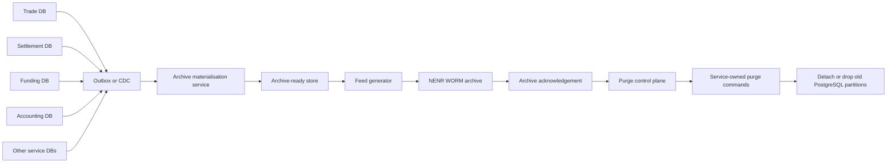

# Data archival strategy for high-volume event-driven microservices

## Strategic conclusion

For the architecture you described, the industry-standard answer is **not** a large weekend job that scans five live microservice databases, joins the data on demand, writes a text file, marks rows, and then deletes them row by row. In a database-per-service architecture, each service owns its data, and cross-service reporting or archival queries are typically handled through **CQRS or materialised views** that are populated asynchronously, rather than by treating operational databases as a shared data warehouse. For long-term sustainability at 500k to 5 million trades per day, the stronger pattern is: **capture archive-relevant changes continuously, build an archive-ready projection continuously, export from that projection in small controlled batches, and purge source data using partition lifecycle management rather than mass `DELETE`s**. citeturn15view4turn17view0turn20view2turn15view11

Your “NENR” target is effectively a **non-erasable, non-rewritable** archive, which is the same design idea as **WORM** storage. In regulated environments, that model is used to preserve records so they cannot be overwritten or deleted during the retention period, and it is typically paired with retention controls, auditability, and the ability to retrieve both the records and their indexes. IBM’s archival guidance describes NENR/WORM retention with tamper-proof audit logs and both time-based and event-based retention policies, while SEC recordkeeping guidance historically required records to be preserved in a non-rewriteable, non-erasable format and to remain readily downloadable with indexes. citeturn26view0turn16view0turn16view1

If I reduce the recommendation to one sentence, it is this: **build a separate archive data product from events or CDC, not from weekend joins across live service databases; then delete from PostgreSQL by dropping old partitions after archive acknowledgement**. PostgreSQL’s own documentation is explicit that removing old data by dropping or detaching partitions is far faster than bulk deletion and avoids the `VACUUM` overhead that follows large `DELETE`s. citeturn15view0turn15view1

## Why the weekend sweep is the wrong unit of work

The current pattern creates three separate scaling problems. First, it **breaks the natural boundary of microservices** by turning five operational databases into an ad hoc integration layer. Microsoft’s microservices guidance says each service manages its own private data store and that queries spanning services should be handled through asynchronous approaches and read models. Chris Richardson’s database-per-service guidance makes the same point and specifically names CQRS materialised views as the pattern for multi-service queries. A weekend archival join across five databases is therefore workable as a temporary expedient, but it is not the shape of a long-lived platform. citeturn17view0turn20view2

Second, the pattern is **hostile to PostgreSQL storage behaviour** once volumes rise. PostgreSQL warns that massive delete activity leaves large numbers of dead row versions; reclaiming that space can require table rewrites such as `VACUUM FULL`, `CLUSTER`, or table-rewriting `ALTER TABLE`, all of which require an `ACCESS EXCLUSIVE` lock. By contrast, native partitioning gives you a retention mechanism that removes old data by altering the partition structure rather than deleting individual rows. citeturn15view1turn15view0

Third, a single weekend run becomes a **large operational blast radius**. At your upper bound of 5 million trades per day, a weekly run can easily mean 35 million trade records before you even count settlement, funding, accounting, child tables, audit rows, or retries. That pushes you towards long runtimes, difficult restart logic, and painful rollback paths. Continuous CDC and incremental snapshot tooling exist precisely to avoid these stop-the-world batch windows. Debezium’s PostgreSQL connector, for example, supports incremental snapshots that run in parallel with streamed change capture and can resume after interruption rather than restarting from the beginning. citeturn15view8turn15view3

For those reasons, the better operational unit is usually **daily or intra-day micro-batching**, even if the formal archival policy is still “settlement date plus 90 days”. That is an architectural inference rather than a vendor rule, but it follows directly from PostgreSQL’s partition-removal advantages and from CDC tooling that is designed for continuous capture rather than infrequent, high-stress sweeps. A weekend window can still exist as a catch-up or reconciliation slot, but it should not be the primary mechanism. citeturn15view0turn15view8

## Target architecture for a long-lived archival platform

The durable pattern is to create an **archive projection layer** that is fed continuously from the services, so that the system does the “join” all week and only does the file export when the retention clock has expired.

This architecture is a direct application of standard microservice data patterns. A service updates its business data and emits an event through a **transactional outbox** or through **CDC from the transaction log**. The outbox pattern exists because updating the database and publishing a message cannot safely rely on distributed 2PC in most microservice estates; the message is written in the same transaction as the business change, and a relay process publishes it afterwards. PostgreSQL’s logical decoding documentation explains that persistent table changes can be extracted from WAL into an application-friendly stream, which is why CDC is such a natural fit here. citeturn15view11turn18view4turn15view3turn15view13

The **archive materialisation service** then becomes the place where the trade, settlement, funding, and accounting views are assembled. This is the same core idea as CQRS: maintain one or more read-optimised views that combine information from multiple services and keep them current by subscribing to service events. If you already use Kafka, this can be implemented with Kafka Streams or ksqlDB; both support stateful joins, local state stores, and scaling by partition. The important design detail is that the join key must be partition-aligned, so the same business key is co-located for stateful joins. citeturn20view2turn20view0turn15view9turn15view10turn18view2

This archive-ready store should hold the **canonical archive record** and a small amount of archive control metadata. In practice that means one row or document per business archive unit, keyed by a deterministic business identifier such as trade ID or settlement ID, with fields for: required output columns, settlement date, archive eligibility date, completeness flags, feed schema version, archive state, file ID, and purge acknowledgement state. Microsoft’s guidance on distributed data specifically notes that when work spans multiple services, you often need extra durable state that captures the progress of that unit of work. citeturn17view0

You do **not** need to jump straight to full event sourcing to do this well. Full event sourcing is the most audit-friendly design because it records an append-only event stream and derives materialised views from it, but it is also a larger application change. Azure’s event sourcing guidance shows the advantages of immutable events and materialised views, especially for audit trails and replay, but for most existing estates a more pragmatic first step is **outbox plus CDC plus archive projection**. That gets you nearly all of the archival benefits without re-platforming the entire write model. citeturn20view0turn15view11turn18view5

One caution is worth stating plainly: **treat ingestion as at-least-once unless your exact CDC product documents stronger guarantees for production use**. Kafka Streams supports exactly-once processing for the materialisation layer, but connector-level guarantees vary by platform; for example, Confluent’s managed PostgreSQL CDC connector documents exactly-once as an early-access feature and not for production use. Microsoft’s event-driven microservices guidance also stresses idempotence. So the safe rule is: deterministic keys, idempotent upserts, and replay-safe archive states. citeturn22view0turn18view0turn15view12

## PostgreSQL retention and purge mechanics

On the PostgreSQL side, the most important design decision is to align storage with retention. Because your policy is based on **settlement date + 90 days**, your heavy-write tables should be partitioned by a field that maps directly to that rule: ideally `settlement_date`, and where that is not native to the table, a derived **`archive_cutoff_date`** or similar field stamped into the row by the service when the business state becomes known. That avoids expensive future lookups just to discover eligibility. PostgreSQL’s partitioning guidance explicitly calls out bulk deletes via partition removal as a principal use case, especially where older data can be moved to cheaper storage. citeturn15view0turn12search2

At your scale, **daily partitions** are usually the pragmatic starting point. That is not because PostgreSQL demands daily intervals, but because daily partitions turn your purge unit into a 1-day slice instead of a 7-day or 30-day slice. It is much easier to verify, retry, and, if necessary, hold back a single day than an entire week. PostgreSQL partition maintenance is designed for periodic removal and addition of time windows, and operational archive guidance for large exported datasets likewise recommends date partitioning rather than keeping archives as undifferentiated heaps. citeturn14search1turn16view7

Once a partition’s contents have been exported and the archive system has acknowledged receipt, purge should be a **partition lifecycle operation** wherever possible: `DETACH PARTITION` if you want a short safety buffer, then `DROP TABLE` once your grace period passes. PostgreSQL explicitly says this is far faster than bulk deletion and entirely avoids the `VACUUM` overhead caused by a bulk `DELETE`. That is the single highest-leverage change you can make for purge performance. citeturn15view0

For tables you cannot partition immediately, use **batched updates and deletes as a transitional tactic**, not as the target end state. PostgreSQL documents `SKIP LOCKED` for queue-like workloads and shows how to use ordered, repeated updates in chunks, while noting that a final pass without `SKIP LOCKED` is needed if you want to ensure nothing was missed. This is useful for an interim “mark ready”, “mark archived”, or “delete in chunks” process, but PostgreSQL also warns that `SKIP LOCKED` gives an inconsistent view and is therefore suited to work queues rather than general-purpose querying. citeturn16view4turn16view5

If you need an interim solution before the projection layer is live, offload heavy candidate discovery and export reads away from primaries. PostgreSQL hot standby exists specifically to allow read-only queries on standby servers, and PostgreSQL also supports logical replication of data changes on a per-table basis. That means a transitional architecture can use standbys or replica stores for candidate extraction, while still reserving deletes and partition drops for the owning service on the primary. citeturn21search0turn21search2turn28search1

## Feed generation and immutable archive controls

The pipe-delimited feed file should be generated from the **archive-ready store**, not from the five operational databases. That gives you a single source for schema mapping, idempotent restarts, and operational metrics. PostgreSQL’s `COPY` command can export the results of a `SELECT` query directly, and the documentation even shows a `COPY ... TO STDOUT (DELIMITER '|')` example using a vertical bar as the field separator. citeturn15view2turn24view0

There is one subtle but important file-format choice. If the vendor genuinely expects “plain pipe-delimited text”, PostgreSQL text format will write one line per row, but any embedded delimiters, carriage returns, or newlines inside the data must be escaped with backslashes. If the vendor accepts delimited text with quote semantics, **CSV format with `DELIMITER '|'` is usually safer**, because PostgreSQL will automatically quote fields that contain delimiters, quotes, or line breaks. In other words: use plain text only if the receiver’s parser truly expects plain text rules; otherwise, a pipe-delimited CSV is operationally safer. citeturn24view2turn25view0turn24view1

I would strongly recommend that you **build internally in chunks even if the vendor contract says “one file”**. Internally, produce chunk files or chunked query ranges with a manifest; only at the final hand-off stage should you combine them into a single artefact if that is mandatory. This is an engineering recommendation based on restartability and observability. It aligns well with cloud object-store best practice, which recommends partitioned archive layouts rather than heap dumps, and with multipart upload patterns that preserve metadata and integrity information during large transfers. citeturn16view7turn29view1

For the immutable hand-off, the archive package should include more than the data rows. In regulated recordkeeping, preserved records are commonly paired with **indexes, timestamps, retention metadata, and an audit trail**. SEC guidance historically required stored records to be non-rewriteable and non-erasable, to verify the recording process, to serialize and time-date the stored information, and to be readily downloadable together with their indexes. IBM’s archive guidance similarly describes tamper-proof audit logs plus time-based and event-based retention controls. That means your design should include a **searchable archive index** outside the data file itself: file ID, business key range, record count, retention class, eligibility date, hash/checksum, archive receipt timestamp, and legal-hold status. citeturn16view0turn16view1turn26view0

On immutability, the modern cloud equivalents are straightforward: Amazon S3 Object Lock and Azure immutable Blob storage both implement WORM-style controls that prevent overwrite or deletion for a fixed retention period or indefinitely. Even if your destination is a third-party archival platform rather than cloud object storage, those vendor-neutral ideas still apply: **immutability, retention policy, legal or event-based hold, and auditable retrieval**. citeturn16view2turn16view3

For transfer integrity, add a **file-level checksum** and keep it in the archive index and the hand-off manifest. AWS documents full-object checksum validation on upload and storage of checksum metadata for later integrity verification. That is cloud-specific documentation, but the underlying design principle is universal: if a large archive file is moved, you want a machine-verifiable integrity check at both ends. citeturn29view0turn29view1

## Practical migration path for your estate

The best way to implement this is usually in phases rather than through a single “big-bang” redesign. **Phase one** is to stop relying on weekend joins: add outbox events or CDC capture for the trade, settlement, funding, accounting, and related services, and build a separate archive-ready store keyed by the business archive key. **Phase two** is to export the vendor feed from that store daily, or several times per day, while leaving source data in place until you have stabilised the feed and the acknowledgement process. **Phase three** is to partition the large PostgreSQL tables by the retention-driving date and switch purge from row deletes to partition detach/drop after archive acknowledgement. citeturn15view11turn15view3turn15view0

The **control plane** matters as much as the data plane. Maintain a durable archive state machine that is independent of the source rows you will later delete. Typical states are: `OPEN`, `READY`, `EXPORTED`, `ACKNOWLEDGED`, `PURGE_PENDING`, `PURGED`, and `EXCEPTION`. This is an application of the standard distributed-data recommendation to keep explicit durable work-state for multi-step processes. It also makes the whole pipeline restartable and auditable. citeturn17view0

Purge should remain **service-owned**, even if archive orchestration is central. In other words, a central controller can publish a purge manifest or purge command, but the service that owns the database should execute the delete or partition drop. That preserves data sovereignty and avoids turning archival into a backdoor shared-database anti-pattern. citeturn15view4turn17view0

Operationally, the platform should expose a small set of non-negotiable metrics: CDC lag, event replay lag, archive-ready completeness, number of records awaiting archive, oldest eligible-but-unarchived date, feed build duration, archive acknowledgement latency, purge backlog by service, partition count, partition storage, and exception counts. Where late-arriving updates are possible, hold records in the archive-ready store until both the retention date and your completeness rules are satisfied; if you already have a streaming platform, event-time handling and grace periods are the usual mechanisms for this kind of correctness trade-off. citeturn22view0

For your specific case, my recommendation is therefore quite direct. **Run the archival workflow every day**, not only at weekends. Let weekends be a quieter operational period for catch-up, verification, or backlog reduction, but not the sole execution window. The long-term platform should be:

1. **Continuous capture** from service databases via outbox or CDC.  
2. **Continuous materialisation** of a canonical archive record in a separate archive-ready store.  
3. **Daily export** of eligible records to the required pipe-delimited feed.  
4. **Archive acknowledgement and immutable retention** with searchable indexes and audit metadata.  
5. **Service-owned purge** using partition detach/drop wherever possible, with chunked deletes only as a temporary fallback. citeturn15view11turn15view3turn20view2turn15view0turn16view0turn26view0

That architecture is the one most likely to remain stable as volumes grow from hundreds of thousands to millions of trades per day, because it removes the two main bottlenecks in your current design: **late binding of multi-service data**, and **row-by-row deletion from hot PostgreSQL tables**. citeturn20view2turn15view0turn15view1