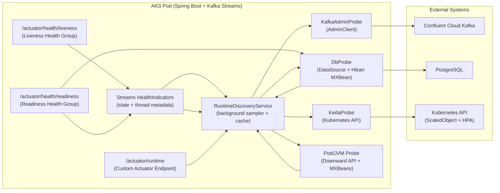

# Runtime Environment Discovery and Health API for Spring Boot + Kafka Streams on AKS

## Executive summary

You can build a robust “runtime environment discovery” API by separating **fast health signalling** (for AKS probes) from **rich diagnostic discovery** (for humans, runbooks, and incident automation). Spring Boot Actuator already gives you the probe primitives (`/actuator/health/liveness`, `/actuator/health/readiness`) and health groups, plus guidance on which kinds of checks belong in each probe. citeturn3view0turn0search1

A safe first-release design (recommended for your stack: **Spring Boot 3 + Java 21 + Kafka Streams + Confluent Cloud + PostgreSQL + KEDA on AKS**) is:

- **Liveness = internal correctness only**: “Is my Streams client alive and are my stream threads alive?” (No DB/Kafka external checks). This aligns with Spring Boot’s warning that external-system checks in liveness can cause cascading restarts. citeturn3view0  
- **Readiness = ability to serve workload**: include DB connectivity / pool pressure and (optionally) Kafka admin reachability if it’s specific to a single instance and not a shared dependency. Spring Boot deliberately does not include external checks in readiness by default; you decide what to include. citeturn3view0  
- **Discovery endpoint = aggregated JSON**: a secured REST API (implemented as a **custom Actuator endpoint**) returning a cached snapshot of:
  - system/environment identifiers
  - Kafka cluster ID and bootstrap (sanitised)
  - Streams app IDs / consumer groups, stream thread states, selected Streams configs
  - topic partitions and lag summary via `AdminClient`
  - KEDA `ScaledObject` and derived HPA status via Kubernetes API
  - DataSource/Hikari pool status and DB host (sanitised)
  - pod/node/JVM metadata (Downward API + JVM MXBeans)
- **Non-blocking behaviour**: the REST endpoint returns the *latest snapshot* immediately; sampling happens in the background with strict timeouts and graceful degradation.  
- **Security**: use Actuator exposure controls and Spring Security patterns recommended by Spring Boot; sanitise sensitive values (Spring warns that endpoint data can be sensitive and that you should secure exposed endpoints). citeturn17view0turn17view1


---

## Quick start — minimum setup for health probes (no code required)

If all you need is Kubernetes liveness, readiness, and health endpoints, the entire setup is **3 steps — no Java code, no SecurityFilterChain, no S2S whitelist**.

### Step 1 — Add the Actuator dependency in `pom.xml`

```xml
<dependency>
    <groupId>org.springframework.boot</groupId>
    <artifactId>spring-boot-starter-actuator</artifactId>
</dependency>
```

### Step 2 — Add 3 properties in `application.properties`

```properties
management.server.port=9090
management.endpoint.health.probes.enabled=true
management.endpoints.web.exposure.include=health
```

### Step 3 — Add probes in your Kubernetes Deployment manifest

```yaml
livenessProbe:
  httpGet:
    path: /actuator/health/liveness
    port: 9090
readinessProbe:
  httpGet:
    path: /actuator/health/readiness
    port: 9090
```

### What you get (zero code)

| Endpoint | Purpose | Auto-registered? |
|----------|---------|-----------------|
| `/actuator/health` | Overall app health — `UP` or `DOWN` | Yes |
| `/actuator/health/liveness` | Is the JVM alive? Kubelet restarts pod if `DOWN` | Yes |
| `/actuator/health/readiness` | Can the app accept traffic? Kubelet removes from Service if `DOWN` | Yes |

### Why no security configuration is needed

Actuator runs on a **separate management port (9090)**, completely isolated from your business API port (8080). The traffic flow is:

```
Internet → Ingress → Service → Pod:8080 → SecurityFilterChain / S2S / SPIFFE
                                             (your business APIs — fully secured)

Kubelet  → Pod:9090 → Actuator health endpoints
                        (cluster-internal only — never exposed outside the cluster)
```

- Port 9090 is **not routed** through any Kubernetes Service or Ingress — only Kubelet on the same node can reach it.
- Even if you have `spring-boot-starter-security` with a custom `SecurityFilterChain` on port 8080, it does **not** affect port 9090 — they run in separate Spring application contexts.
- No S2S token, no SPIFFE cert, no filter-chain whitelist is required for health probes.

### Auto-detected health indicators

When you add infrastructure dependencies, Spring Boot automatically registers health checks — zero code:

| Dependency added | Health indicator | What it checks |
|-----------------|-----------------|---------------|
| `spring-boot-starter-data-jpa` + DataSource | `db` | Executes validation query (`SELECT 1` / `isValid()`) |
| `spring-kafka` | `kafka` | Kafka broker connectivity |
| `spring-boot-starter-data-redis` | `redis` | Redis `PING` command |

> **Important distinction:** These health indicators make **real connections** (e.g. `SELECT 1` to the database). The `/actuator/runtime` discovery endpoint described in the rest of this document only reads **local config properties** — it does not make any external calls.

### When to read beyond this section

This quick start gives you production-ready health probes. Continue to the detailed sections below if you need:
- Custom health indicators (e.g. circuit breaker state, Kafka Streams thread health)
- A runtime discovery endpoint for deployment verification (`/actuator/runtime`)
- KEDA autoscaling integration and ScaledObject status
- Security hardening for non-health actuator endpoints
- JSON schema for the full discovery response

---

## Architecture and data contract

Spring Boot exposes liveness/readiness probe endpoints as health groups and supports configuring additional indicators into those groups. It also warns that if Actuator endpoints run on a separate management port, probes might succeed even if the main application cannot accept connections; it therefore suggests making liveness/readiness available on the main server port (e.g. `/livez` and `/readyz`). citeturn3view0

Kafka Streams provides JVM-level state (`KafkaStreams.state()`), per-thread runtime metadata (`metadataForLocalThreads()`), and controlled behaviour when an internal thread crashes via `StreamsUncaughtExceptionHandler` responses such as `REPLACE_THREAD` and `SHUTDOWN_CLIENT`. citeturn7search0turn7search5turn7search13

Kafka Streams configuration contains precisely the knobs you want to expose (safely), such as:
- `num.stream.threads` (“number of threads to execute stream processing”) citeturn6view2  
- `commit.interval.ms` (“frequency … to save the position/offsets of tasks”) citeturn5view0  
- `processing.guarantee` (e.g. `at_least_once`, `exactly_once_v2`) citeturn6view1  
- `num.standby.replicas` (standby replicas are “shadow copies of local state stores … used to minimise failover latency”) citeturn6view0  
- `default.deserialization.exception.handler` and `default.production.exception.handler` (both return `FAIL` or `CONTINUE`; `FAIL` signals Streams should shut down) citeturn5view0turn2search2

For lag and partitions, Kafka’s `AdminClient` supports:
- `describeCluster().clusterId()` (cluster ID future) citeturn8search1  
- `listConsumerGroupOffsets(groupId)` citeturn2search17  
- `listOffsets(topicPartitions → OffsetSpec)` to fetch end offsets citeturn8search0

For KEDA + AKS:
- A `ScaledObject` references the target workload in `.spec.scaleTargetRef` and defines `pollingInterval`/`cooldownPeriod` etc. citeturn13view0  
- KEDA’s `apache-kafka-go` scaler exposes metadata such as `bootstrapServers`, `consumerGroup`, `topic`, `lagThreshold`, `activationLagThreshold`, `allowIdleConsumers`. citeturn14search0  
- The `ScaledObject` CRD status includes conditions (Ready/Active/Fallback/Paused) and fields like `hpaName`, `lastActiveTime`, `originalReplicaCount`, `pausedReplicaCount`. citeturn12view0  
- Kubernetes HPA exposes status conditions indicating whether it is able to scale and whether it is limited. citeturn9search16turn9search2  
- Pod metadata can be injected via the Downward API (environment variables or files). citeturn1search1turn1search5  
- A pod can access the Kubernetes API using mounted ServiceAccount credentials; RBAC controls what it can read. citeturn9search0turn9search4turn9search5  

### Mermaid component interaction diagram



## JSON schema and example response

Below is a pragmatic schema (Draft 2020-12 style) that is stable enough for tooling, while letting you add fields over time. The core idea is an `Observed<T>` wrapper: each component includes `sampledAt`, `durationMs`, `status`, and optional `error`, and may return stale data when a probe fails.

### JSON schema

```json
{
  "$schema": "https://json-schema.org/draft/2020-12/schema",
  "$id": "https://example.internal/schemas/runtime-discovery.schema.json",
  "title": "RuntimeDiscoveryReport",
  "type": "object",
  "required": ["meta", "components"],
  "properties": {
    "meta": {
      "type": "object",
      "required": ["system", "environment", "generatedAt", "cacheAgeMs"],
      "properties": {
        "system": { "type": "string" },
        "environment": { "type": "string" },
        "version": { "type": "string" },
        "build": { "type": "string" },
        "generatedAt": { "type": "string", "format": "date-time" },
        "cacheAgeMs": { "type": "integer", "minimum": 0 },
        "refreshIntervalMs": { "type": "integer", "minimum": 1 }
      },
      "additionalProperties": false
    },
    "components": {
      "type": "object",
      "required": ["pod", "jvm", "streams", "kafka", "database", "keda"],
      "properties": {
        "pod": { "$ref": "#/$defs/ObservedPod" },
        "jvm": { "$ref": "#/$defs/ObservedJvm" },
        "streams": { "$ref": "#/$defs/ObservedStreams" },
        "kafka": { "$ref": "#/$defs/ObservedKafka" },
        "database": { "$ref": "#/$defs/ObservedDatabase" },
        "keda": { "$ref": "#/$defs/ObservedKeda" }
      },
      "additionalProperties": true
    }
  },
  "$defs": {
    "ErrorInfo": {
      "type": "object",
      "required": ["type", "message"],
      "properties": {
        "type": { "type": "string" },
        "message": { "type": "string" },
        "at": { "type": "string", "format": "date-time" }
      },
      "additionalProperties": false
    },
    "ObservedBase": {
      "type": "object",
      "required": ["status", "sampledAt", "durationMs", "stale"],
      "properties": {
        "status": { "type": "string", "enum": ["UP", "WARN", "DOWN", "UNKNOWN"] },
        "sampledAt": { "type": "string", "format": "date-time" },
        "durationMs": { "type": "integer", "minimum": 0 },
        "stale": { "type": "boolean" },
        "error": { "$ref": "#/$defs/ErrorInfo" }
      }
    },
    "ObservedPod": {
      "allOf": [
        { "$ref": "#/$defs/ObservedBase" },
        {
          "type": "object",
          "properties": {
            "data": {
              "type": "object",
              "properties": {
                "podName": { "type": "string" },
                "namespace": { "type": "string" },
                "nodeName": { "type": "string" },
                "podIp": { "type": "string" }
              },
              "additionalProperties": true
            }
          }
        }
      ]
    },
    "ObservedJvm": {
      "allOf": [
        { "$ref": "#/$defs/ObservedBase" },
        {
          "type": "object",
          "properties": {
            "data": {
              "type": "object",
              "properties": {
                "javaVersion": { "type": "string" },
                "vmName": { "type": "string" },
                "uptimeMs": { "type": "integer" },
                "heapUsedBytes": { "type": "integer" },
                "heapMaxBytes": { "type": "integer" }
              },
              "additionalProperties": true
            }
          }
        }
      ]
    },
    "ObservedStreams": {
      "allOf": [
        { "$ref": "#/$defs/ObservedBase" },
        {
          "type": "object",
          "properties": {
            "data": {
              "type": "object",
              "required": ["instances"],
              "properties": {
                "instances": {
                  "type": "array",
                  "items": {
                    "type": "object",
                    "required": ["beanName", "applicationId", "state", "threads", "config"],
                    "properties": {
                      "beanName": { "type": "string" },
                      "applicationId": { "type": "string" },
                      "state": { "type": "string" },
                      "threads": {
                        "type": "array",
                        "items": {
                          "type": "object",
                          "properties": {
                            "threadName": { "type": "string" },
                            "threadState": { "type": "string" },
                            "activeTasks": { "type": "integer" },
                            "standbyTasks": { "type": "integer" }
                          },
                          "additionalProperties": false
                        }
                      },
                      "config": {
                        "type": "object",
                        "additionalProperties": { "type": "string" }
                      }
                    },
                    "additionalProperties": true
                  }
                }
              },
              "additionalProperties": true
            }
          }
        }
      ]
    },
    "ObservedKafka": {
      "allOf": [
        { "$ref": "#/$defs/ObservedBase" },
        {
          "type": "object",
          "properties": {
            "data": {
              "type": "object",
              "properties": {
                "bootstrapServers": { "type": "string" },
                "clusterId": { "type": "string" },
                "lagSummary": { "type": "object" }
              },
              "additionalProperties": true
            }
          }
        }
      ]
    },
    "ObservedDatabase": {
      "allOf": [
        { "$ref": "#/$defs/ObservedBase" },
        {
          "type": "object",
          "properties": {
            "data": {
              "type": "object",
              "properties": {
                "dbType": { "type": "string" },
                "host": { "type": "string" },
                "database": { "type": "string" },
                "pool": { "type": "object" }
              },
              "additionalProperties": true
            }
          }
        }
      ]
    },
    "ObservedKeda": {
      "allOf": [
        { "$ref": "#/$defs/ObservedBase" },
        {
          "type": "object",
          "properties": {
            "data": {
              "type": "object",
              "properties": {
                "scaledObject": { "type": "object" },
                "hpa": { "type": "object" }
              },
              "additionalProperties": true
            }
          }
        }
      ]
    }
  }
}
```

### Example response (abridged)

```json
{
  "meta": {
    "system": "settlement-service",
    "environment": "prod",
    "version": "1.0.0",
    "build": "2026-03-02.4",
    "generatedAt": "2026-03-05T10:21:34.120Z",
    "cacheAgeMs": 412,
    "refreshIntervalMs": 30000
  },
  "components": {
    "pod": {
      "status": "UP",
      "sampledAt": "2026-03-05T10:21:33.900Z",
      "durationMs": 1,
      "stale": false,
      "data": {
        "podName": "settlement-service-7b4f8d78ff-2kq9x",
        "namespace": "payments",
        "nodeName": "aks-nodepool1-12345678-vmss00000f",
        "podIp": "10.244.1.27"
      }
    },
    "jvm": {
      "status": "UP",
      "sampledAt": "2026-03-05T10:21:33.901Z",
      "durationMs": 2,
      "stale": false,
      "data": {
        "javaVersion": "21.0.2",
        "vmName": "OpenJDK 64-Bit Server VM",
        "uptimeMs": 864213,
        "heapUsedBytes": 412345678,
        "heapMaxBytes": 2147483648
      }
    },
    "streams": {
      "status": "UP",
      "sampledAt": "2026-03-05T10:21:33.920Z",
      "durationMs": 8,
      "stale": false,
      "data": {
        "instances": [
          {
            "beanName": "settlementStreamsBuilderFactoryBean",
            "applicationId": "settlement-service-prod",
            "state": "RUNNING",
            "threads": [
              { "threadName": "settlement-service-prod-StreamThread-1", "threadState": "RUNNING", "activeTasks": 24, "standbyTasks": 0 },
              { "threadName": "settlement-service-prod-StreamThread-2", "threadState": "RUNNING", "activeTasks": 24, "standbyTasks": 0 }
            ],
            "config": {
              "num.stream.threads": "2",
              "commit.interval.ms": "1000",
              "processing.guarantee": "at_least_once",
              "max.poll.records": "50",
              "num.standby.replicas": "0",
              "default.deserialization.exception.handler": "com.yourco.kafka.DltDeserializationExceptionHandler",
              "default.production.exception.handler": "org.apache.kafka.streams.errors.DefaultProductionExceptionHandler"
            }
          }
        ]
      }
    },
    "kafka": {
      "status": "WARN",
      "sampledAt": "2026-03-05T10:21:33.980Z",
      "durationMs": 120,
      "stale": false,
      "data": {
        "bootstrapServers": "pkc-xxxxx.ap-southeast-1.aws.confluent.cloud:9092",
        "clusterId": "lKx92c9yQ+ws786HYosuBn",
        "lagSummary": {
          "groupId": "settlement-service-prod",
          "topics": [
            { "topic": "settlement.events", "partitions": 48, "totalLag": 1800, "maxLag": 120, "worstPartitions": [12, 17, 41] }
          ]
        }
      }
    },
    "database": {
      "status": "UP",
      "sampledAt": "2026-03-05T10:21:33.940Z",
      "durationMs": 12,
      "stale": false,
      "data": {
        "dbType": "postgresql",
        "host": "postgres-prod.internal",
        "database": "settlement",
        "pool": {
          "active": 6,
          "idle": 14,
          "total": 20,
          "awaitingThreads": 0
        }
      }
    },
    "keda": {
      "status": "UP",
      "sampledAt": "2026-03-05T10:21:34.010Z",
      "durationMs": 44,
      "stale": false,
      "data": {
        "scaledObject": {
          "name": "settlement-service",
          "scaleTargetRef": { "kind": "Deployment", "name": "settlement-service" },
          "pollingIntervalSeconds": 30,
          "cooldownPeriodSeconds": 120,
          "minReplicaCount": 1,
          "maxReplicaCount": 8,
          "conditions": { "Ready": "True", "Active": "True", "Fallback": "False", "Paused": "False" },
          "lastActiveTime": "2026-03-05T10:21:00Z",
          "hpaName": "keda-hpa-settlement-service"
        },
        "hpa": {
          "name": "keda-hpa-settlement-service",
          "currentReplicas": 4,
          "desiredReplicas": 4,
          "conditions": [
            { "type": "AbleToScale", "status": "True" },
            { "type": "ScalingActive", "status": "True" },
            { "type": "ScalingLimited", "status": "False" }
          ]
        }
      }
    }
  }
}
```

## Implementation in Spring Boot

This section provides a copy‑pasteable implementation for **Spring Boot 3 / Java 21**. It is intentionally conservative for first production release: cached snapshots, timeouts everywhere, no secrets returned.

### Maven dependencies (minimum set)

```xml
<dependencies>
  <!-- Web + Actuator -->
  <dependency>
    <groupId>org.springframework.boot</groupId>
    <artifactId>spring-boot-starter-web</artifactId>
  </dependency>
  <dependency>
    <groupId>org.springframework.boot</groupId>
    <artifactId>spring-boot-starter-actuator</artifactId>
  </dependency>

  <!-- Security for actuator + custom endpoint -->
  <dependency>
    <groupId>org.springframework.boot</groupId>
    <artifactId>spring-boot-starter-security</artifactId>
  </dependency>

  <!-- Kafka Streams via Spring for Apache Kafka -->
  <dependency>
    <groupId>org.springframework.kafka</groupId>
    <artifactId>spring-kafka</artifactId>
  </dependency>

  <!-- PostgreSQL + Hikari (Hikari is default pool for Spring Boot JDBC) -->
  <dependency>
    <groupId>org.postgresql</groupId>
    <artifactId>postgresql</artifactId>
    <scope>runtime</scope>
  </dependency>

  <!-- Kubernetes API client (Fabric8) to read ScaledObject + HPA -->
  <dependency>
    <groupId>io.fabric8</groupId>
    <artifactId>kubernetes-client</artifactId>
    <version>6.13.5</version>
  </dependency>

  <!-- Optional: strongly typed autoscaling/v2 models -->
  <dependency>
    <groupId>io.fabric8</groupId>
    <artifactId>kubernetes-model-autoscaling</artifactId>
    <version>6.13.5</version>
  </dependency>
</dependencies>
```

### application.yml (safe go-live defaults)

Key points:
- Only expose the endpoints you need; Spring Boot warns that endpoints may contain sensitive information and that you should carefully consider exposure and secure them. citeturn17view0  
- Enable probes and configure health groups; Spring Boot provides liveness/readiness as health groups and leaves readiness external checks to you. citeturn3view0  
- Use endpoint caching TTL if you implement your discovery endpoint without parameters (optional). Spring Boot supports `management.endpoint.<name>.cache.time-to-live`. citeturn17view1  

```yaml
spring:
  application:
    name: settlement-service

management:
  endpoints:
    web:
      exposure:
        include: health,info,runtime
  endpoint:
    health:
      probes:
        enabled: true
      # Recommended: if management.server.port is different, also expose on main port
      probes:
        add-additional-paths: true
      group:
        liveness:
          # Internal only (avoid external dependencies here)
          include: ping,kafkaStreams,kafkaStreamsThreads
        readiness:
          # Add external dependencies you consider instance-specific
          include: ping,kafkaStreams,kafkaStreamsThreads,dbPool

    # Cache our custom endpoint responses too (optional)
    runtime:
      cache:
        time-to-live: 2s

runtime:
  discovery:
    enabled: true
    refresh-interval: 30s
    stale-after: 2m
    worker-threads: 6
    timeouts:
      pod: 200ms
      jvm: 200ms
      streams: 1s
      kafkaAdmin: 2s
      db: 500ms
      keda: 1s
    kafka:
      # Optional: restrict lag reporting to external topics and exclude internal topics
      include-topic-regex: "^(settlement\\.events)$"
      exclude-topic-regex: ".*-(changelog|repartition)$"
    keda:
      enabled: true
      scaledObjectName: settlement-service
      namespace: ${POD_NAMESPACE:default}
    streams:
      expose-config-keys:
        - application.id
        - bootstrap.servers
        - num.stream.threads
        - commit.interval.ms
        - processing.guarantee
        - consumer.max.poll.records
        - max.poll.records
        - num.standby.replicas
        - default.deserialization.exception.handler
        - default.production.exception.handler
```

### Downward API env vars (Deployment snippet)

Kubernetes supports exposing pod fields via environment variables (Downward API). citeturn1search1turn1search5

```yaml
env:
  - name: POD_NAME
    valueFrom:
      fieldRef:
        fieldPath: metadata.name
  - name: POD_NAMESPACE
    valueFrom:
      fieldRef:
        fieldPath: metadata.namespace
  - name: NODE_NAME
    valueFrom:
      fieldRef:
        fieldPath: spec.nodeName
  - name: POD_IP
    valueFrom:
      fieldRef:
        fieldPath: status.podIP
```

### Code files — current implementation vs future advanced design

The current implementation in this project uses a **simple, synchronous** approach:
- No background threads — computes on-demand when you call `/actuator/runtime`
- No external calls — reads only local properties, environment variables, and in-memory JVM/Kafka Streams state
- Caching via Actuator's built-in `management.endpoint.runtime.cache.time-to-live: 5s`
- Response is instant (sub-millisecond)

The code files below describe a **future advanced design** with background sampling, thread pools, external system probes (AdminClient, DB, Kubernetes API), and graceful degradation. **You do not need this for the current implementation.** Adopt it when you need real-time lag queries, KEDA status, or DB pool monitoring in the `/actuator/runtime` response.

| Aspect | Current implementation (what you have) | Future advanced design (below) |
|--------|----------------------------------------|-------------------------------|
| Threading | No background threads | `ScheduledExecutorService` with configurable thread pool |
| Sampling | On-demand when endpoint is called | Periodic background sampling every N seconds |
| External calls | None — local properties + in-memory state only | Kafka `AdminClient`, DB connection, Kubernetes API |
| Caching | Actuator built-in response cache (5s TTL) | Custom `AtomicReference<Snapshot>` with stale detection |
| Error handling | Try-catch per section, returns `"error": "..."` | `Observed<T>` wrapper with `UP/WARN/DOWN/UNKNOWN` + graceful fallback to stale data |

---

> **⚠️ FUTURE / ADVANCED — The code below is NOT part of the current implementation. It is a reference design for when you need external system probes in the runtime discovery endpoint.**

---

#### `Observed.java`

```java
package com.yourco.runtime.model;

import java.time.Instant;

public record Observed<T>(
        Status status,
        Instant sampledAt,
        long durationMs,
        boolean stale,
        T data,
        ErrorInfo error
) {
    public enum Status { UP, WARN, DOWN, UNKNOWN }

    public static <T> Observed<T> up(Instant at, long ms, T data) {
        return new Observed<>(Status.UP, at, ms, false, data, null);
    }

    public static <T> Observed<T> warn(Instant at, long ms, T data, ErrorInfo err, boolean stale) {
        return new Observed<>(Status.WARN, at, ms, stale, data, err);
    }

    public static <T> Observed<T> down(Instant at, long ms, ErrorInfo err) {
        return new Observed<>(Status.DOWN, at, ms, false, null, err);
    }

    public static <T> Observed<T> unknown(Instant at, long ms, ErrorInfo err) {
        return new Observed<>(Status.UNKNOWN, at, ms, false, null, err);
    }
}
```

#### `ErrorInfo.java`

```java
package com.yourco.runtime.model;

import java.time.Instant;

public record ErrorInfo(
        String type,
        String message,
        Instant at
) {
    public static ErrorInfo of(Throwable t) {
        return new ErrorInfo(t.getClass().getName(), safeMessage(t), Instant.now());
    }

    private static String safeMessage(Throwable t) {
        String msg = t.getMessage();
        return msg == null ? t.toString() : msg;
    }
}
```

#### `RuntimeDiscoveryReport.java`

```java
package com.yourco.runtime.model;

import java.time.Instant;
import java.util.Map;

public record RuntimeDiscoveryReport(
        Meta meta,
        Map<String, Observed<?>> components
) {
    public record Meta(
            String system,
            String environment,
            String version,
            String build,
            Instant generatedAt,
            long cacheAgeMs,
            long refreshIntervalMs
    ) {}
}
```

This keeps the response extensible (`components` is a map), while still producing a stable schema for known component keys.

#### `RuntimeDiscoveryProperties.java`

```java
package com.yourco.runtime.config;

import org.springframework.boot.context.properties.ConfigurationProperties;

import java.time.Duration;
import java.util.List;
import java.util.Map;

@ConfigurationProperties(prefix = "runtime.discovery")
public class RuntimeDiscoveryProperties {

    private boolean enabled = true;
    private Duration refreshInterval = Duration.ofSeconds(30);
    private Duration staleAfter = Duration.ofMinutes(2);
    private int workerThreads = 6;

    private Map<String, Duration> timeouts = Map.of(
            "pod", Duration.ofMillis(200),
            "jvm", Duration.ofMillis(200),
            "streams", Duration.ofSeconds(1),
            "kafkaAdmin", Duration.ofSeconds(2),
            "db", Duration.ofMillis(500),
            "keda", Duration.ofSeconds(1)
    );

    private Kafka kafka = new Kafka();
    private Keda keda = new Keda();
    private Streams streams = new Streams();

    public static class Kafka {
        private String includeTopicRegex = ".*";
        private String excludeTopicRegex = ".*-(changelog|repartition)$";
        public String getIncludeTopicRegex() { return includeTopicRegex; }
        public void setIncludeTopicRegex(String includeTopicRegex) { this.includeTopicRegex = includeTopicRegex; }
        public String getExcludeTopicRegex() { return excludeTopicRegex; }
        public void setExcludeTopicRegex(String excludeTopicRegex) { this.excludeTopicRegex = excludeTopicRegex; }
    }

    public static class Keda {
        private boolean enabled = true;
        private String scaledObjectName;
        private String namespace = "default";
        public boolean isEnabled() { return enabled; }
        public void setEnabled(boolean enabled) { this.enabled = enabled; }
        public String getScaledObjectName() { return scaledObjectName; }
        public void setScaledObjectName(String scaledObjectName) { this.scaledObjectName = scaledObjectName; }
        public String getNamespace() { return namespace; }
        public void setNamespace(String namespace) { this.namespace = namespace; }
    }

    public static class Streams {
        private List<String> exposeConfigKeys = List.of(
                "application.id",
                "bootstrap.servers",
                "num.stream.threads",
                "commit.interval.ms",
                "processing.guarantee",
                "consumer.max.poll.records",
                "max.poll.records",
                "num.standby.replicas",
                "default.deserialization.exception.handler",
                "default.production.exception.handler"
        );
        public List<String> getExposeConfigKeys() { return exposeConfigKeys; }
        public void setExposeConfigKeys(List<String> exposeConfigKeys) { this.exposeConfigKeys = exposeConfigKeys; }
    }

    public boolean isEnabled() { return enabled; }
    public void setEnabled(boolean enabled) { this.enabled = enabled; }
    public Duration getRefreshInterval() { return refreshInterval; }
    public void setRefreshInterval(Duration refreshInterval) { this.refreshInterval = refreshInterval; }
    public Duration getStaleAfter() { return staleAfter; }
    public void setStaleAfter(Duration staleAfter) { this.staleAfter = staleAfter; }
    public int getWorkerThreads() { return workerThreads; }
    public void setWorkerThreads(int workerThreads) { this.workerThreads = workerThreads; }
    public Map<String, Duration> getTimeouts() { return timeouts; }
    public void setTimeouts(Map<String, Duration> timeouts) { this.timeouts = timeouts; }
    public Kafka getKafka() { return kafka; }
    public void setKafka(Kafka kafka) { this.kafka = kafka; }
    public Keda getKeda() { return keda; }
    public void setKeda(Keda keda) { this.keda = keda; }
    public Streams getStreams() { return streams; }
    public void setStreams(Streams streams) { this.streams = streams; }
}
```

#### `Sanitiser.java`

Spring Boot sanitises sensitive values for `/env` and `/configprops` endpoints by default, and documents role-based value exposure (`show-values=when-authorised`). citeturn17view1  
Your custom endpoint should implement its own strict policy:

```java
package com.yourco.runtime.util;

import java.util.Locale;
import java.util.Map;
import java.util.Set;

public final class Sanitiser {

    private static final Set<String> DENY_KEYS = Set.of(
            "sasl.jaas.config",
            "ssl.key.password",
            "ssl.keystore.password",
            "ssl.truststore.password",
            "password",
            "secret",
            "apiKey",
            "apiSecret"
    );

    private Sanitiser() {}

    public static Map<String, String> whitelistAndSanitise(Map<String, ?> raw, Iterable<String> keys) {
        var out = new java.util.LinkedHashMap<String, String>();
        for (String k : keys) {
            Object v = raw.get(k);
            if (v == null) continue;
            out.put(k, sanitiseValue(k, String.valueOf(v)));
        }
        return out;
    }

    public static String sanitiseValue(String key, String value) {
        String lk = key.toLowerCase(Locale.ROOT);
        for (String deny : DENY_KEYS) {
            if (lk.contains(deny.toLowerCase(Locale.ROOT))) return "******";
        }
        // prevent accidental inclusion of Confluent JAAS fragments even if key name differs
        if (value.contains("password=") || value.contains("username=")) return "******";
        return value;
    }
}
```

#### `RuntimeDiscoveryService.java` (background sampler + cache, with graceful degradation)

```java
package com.yourco.runtime;

import com.yourco.runtime.config.RuntimeDiscoveryProperties;
import com.yourco.runtime.model.ErrorInfo;
import com.yourco.runtime.model.Observed;
import com.yourco.runtime.model.RuntimeDiscoveryReport;
import jakarta.annotation.PostConstruct;
import jakarta.annotation.PreDestroy;
import org.springframework.beans.factory.ObjectProvider;
import org.springframework.beans.factory.annotation.Value;
import org.springframework.scheduling.annotation.Scheduled;
import org.springframework.stereotype.Service;

import java.time.Duration;
import java.time.Instant;
import java.util.Map;
import java.util.concurrent.*;
import java.util.concurrent.atomic.AtomicReference;

@Service
public class RuntimeDiscoveryService {

    private final RuntimeDiscoveryProperties props;
    private final Map<String, Probe> probes;

    private final ExecutorService executor;
    private final AtomicReference<Snapshot> cache = new AtomicReference<>();

    @Value("${spring.application.name:unknown}")
    private String appName;

    public RuntimeDiscoveryService(
            RuntimeDiscoveryProperties props,
            ObjectProvider<Map<String, Probe>> probeMapProvider
    ) {
        this.props = props;
        this.probes = probeMapProvider.getIfAvailable(Map::of);

        this.executor = Executors.newFixedThreadPool(
                props.getWorkerThreads(),
                r -> {
                    Thread t = new Thread(r);
                    t.setName("runtime-discovery-" + t.threadId());
                    t.setDaemon(true);
                    return t;
                }
        );
    }

    @PostConstruct
    void initCache() {
        cache.set(new Snapshot(Instant.now(), new RuntimeDiscoveryReport(
                new RuntimeDiscoveryReport.Meta(appName, env(), null, null, Instant.now(), 0, props.getRefreshInterval().toMillis()),
                Map.of()
        )));
    }

    @PreDestroy
    void shutdown() {
        executor.shutdownNow();
    }

    @Scheduled(fixedDelayString = "${runtime.discovery.refresh-interval:30s}")
    public void refresh() {
        if (!props.isEnabled()) return;

        Instant started = Instant.now();
        Snapshot previous = cache.get();

        var futures = probes.entrySet().stream().collect(java.util.stream.Collectors.toMap(
                Map.Entry::getKey,
                e -> runProbe(e.getValue(), timeoutFor(e.getKey()), previous.report().components().get(e.getKey()))
        ));

        // Join all (bounded by max timeout + small cushion)
        Duration max = futures.keySet().stream()
                .map(this::timeoutFor)
                .max(Duration::compareTo)
                .orElse(Duration.ofSeconds(1));
        Duration overall = max.plusMillis(250);

        Map<String, Observed<?>> newComponents;
        try {
            CompletableFuture.allOf(futures.values().toArray(new CompletableFuture[0]))
                    .orTimeout(overall.toMillis(), TimeUnit.MILLISECONDS)
                    .join();

            newComponents = futures.entrySet().stream().collect(java.util.stream.Collectors.toMap(
                    Map.Entry::getKey,
                    e -> e.getValue().getNow(Observed.unknown(Instant.now(), 0, new ErrorInfo("timeout", "overall timeout", Instant.now())))
            ));
        } catch (Exception ex) {
            // If collection fails, keep previous but mark cache age.
            newComponents = previous.report().components();
        }

        RuntimeDiscoveryReport.Meta meta = new RuntimeDiscoveryReport.Meta(
                appName,
                env(),
                null,
                null,
                Instant.now(),
                0,
                props.getRefreshInterval().toMillis()
        );

        cache.set(new Snapshot(started, new RuntimeDiscoveryReport(meta, newComponents)));
    }

    public RuntimeDiscoveryReport getReport() {
        Snapshot s = cache.get();
        long ageMs = Duration.between(s.collectedAt(), Instant.now()).toMillis();

        RuntimeDiscoveryReport.Meta old = s.report().meta();
        RuntimeDiscoveryReport.Meta meta = new RuntimeDiscoveryReport.Meta(
                old.system(),
                old.environment(),
                old.version(),
                old.build(),
                Instant.now(),
                Math.max(0, ageMs),
                old.refreshIntervalMs()
        );

        return new RuntimeDiscoveryReport(meta, s.report().components());
    }

    private CompletableFuture<Observed<?>> runProbe(Probe probe, Duration timeout, Observed<?> previous) {
        Instant start = Instant.now();
        return CompletableFuture.supplyAsync(() -> {
                    try {
                        return probe.sample();
                    } catch (Exception ex) {
                        throw new CompletionException(ex);
                    }
                }, executor)
                .orTimeout(timeout.toMillis(), TimeUnit.MILLISECONDS)
                .handle((val, ex) -> {
                    long ms = Duration.between(start, Instant.now()).toMillis();
                    Instant at = Instant.now();

                    if (ex == null) {
                        return Observed.up(at, ms, val);
                    }

                    ErrorInfo err = ErrorInfo.of(ex instanceof CompletionException ce ? ce.getCause() : ex);

                    // graceful degradation: keep previous data if available and mark stale
                    if (previous != null && previous.data() != null) {
                        return Observed.warn(at, ms, previous.data(), err, true);
                    }
                    return Observed.down(at, ms, err);
                });
    }

    private Duration timeoutFor(String key) {
        return props.getTimeouts().getOrDefault(key, Duration.ofSeconds(1));
    }

    private String env() {
        // prefer explicit env var / property in real systems
        return System.getenv().getOrDefault("APP_ENV", "unknown");
    }

    private record Snapshot(Instant collectedAt, RuntimeDiscoveryReport report) {}
}
```

Here, each probe is keyed by name (e.g. `pod`, `streams`, `kafka`, `keda`) and returns an object. Failures degrade to stale previous values where possible, and the HTTP endpoint never blocks on live calls.

#### `Probe.java` and concrete probes

```java
package com.yourco.runtime;

public interface Probe {
    Object sample() throws Exception;
}
```

##### `PodProbe.java` (Downward API)

```java
package com.yourco.runtime.probes;

import com.yourco.runtime.Probe;
import org.springframework.stereotype.Component;

import java.util.Map;

@Component("pod")
public class PodProbe implements Probe {
    @Override
    public Object sample() {
        return Map.of(
                "podName", System.getenv("POD_NAME"),
                "namespace", System.getenv("POD_NAMESPACE"),
                "nodeName", System.getenv("NODE_NAME"),
                "podIp", System.getenv("POD_IP"),
                "hostname", System.getenv("HOSTNAME")
        );
    }
}
```

##### `JvmProbe.java`

```java
package com.yourco.runtime.probes;

import com.yourco.runtime.Probe;
import org.springframework.stereotype.Component;

import java.lang.management.ManagementFactory;
import java.util.Map;

@Component("jvm")
public class JvmProbe implements Probe {
    @Override
    public Object sample() {
        var rt = ManagementFactory.getRuntimeMXBean();
        var mem = ManagementFactory.getMemoryMXBean();

        return Map.of(
                "javaVersion", System.getProperty("java.version"),
                "vmName", rt.getVmName(),
                "vmVendor", rt.getVmVendor(),
                "uptimeMs", rt.getUptime(),
                "startTimeMs", rt.getStartTime(),
                "heapUsedBytes", mem.getHeapMemoryUsage().getUsed(),
                "heapMaxBytes", mem.getHeapMemoryUsage().getMax()
        );
    }
}
```

##### `StreamsProbe.java` (auto-discovers multiple StreamsBuilderFactoryBean beans)

Spring Kafka exposes Streams configuration via `StreamsBuilderFactoryBean.getStreamsConfiguration()` (and the bean gives access to the internal `KafkaStreams` instance). citeturn16search15turn16search4  
Kafka Streams exposes per-thread metadata via `metadataForLocalThreads()`. citeturn7search0

```java
package com.yourco.runtime.probes;

import com.yourco.runtime.Probe;
import com.yourco.runtime.config.RuntimeDiscoveryProperties;
import com.yourco.runtime.util.Sanitiser;
import org.apache.kafka.streams.KafkaStreams;
import org.springframework.kafka.config.StreamsBuilderFactoryBean;
import org.springframework.stereotype.Component;

import java.util.*;

@Component("streams")
public class StreamsProbe implements Probe {

    private final Map<String, StreamsBuilderFactoryBean> beans;
    private final RuntimeDiscoveryProperties props;

    public StreamsProbe(Map<String, StreamsBuilderFactoryBean> beans,
                        RuntimeDiscoveryProperties props) {
        this.beans = beans;
        this.props = props;
    }

    @Override
    public Object sample() {
        List<Map<String, Object>> instances = new ArrayList<>();

        for (var e : beans.entrySet()) {
            String beanName = e.getKey();
            StreamsBuilderFactoryBean fb = e.getValue();

            Properties streamsCfg = fb.getStreamsConfiguration();
            Map<String, ?> cfgMap = streamsCfg == null ? Map.of() : (Map) streamsCfg;

            KafkaStreams ks = fb.getKafkaStreams();
            String state = ks == null ? "NOT_INITIALISED" : ks.state().name();

            var threadMeta = ks == null ? Set.<org.apache.kafka.streams.processor.ThreadMetadata>of()
                    : ks.metadataForLocalThreads();

            List<Map<String, Object>> threads = threadMeta.stream().map(tm -> Map.<String, Object>of(
                    "threadName", tm.threadName(),
                    "threadState", String.valueOf(tm.threadState()),
                    "activeTasks", tm.activeTasks().size(),
                    "standbyTasks", tm.standbyTasks().size()
            )).toList();

            String appId = streamsCfg == null ? "unknown"
                    : streamsCfg.getProperty("application.id", "unknown");

            instances.add(Map.of(
                    "beanName", beanName,
                    "applicationId", appId,
                    "state", state,
                    "threads", threads,
                    "config", Sanitiser.whitelistAndSanitise(cfgMap, props.getStreams().getExposeConfigKeys())
            ));
        }

        return Map.of("instances", instances);
    }
}
```

##### `KafkaAdminProbe.java` (cluster ID, partitions, lag summary)

Kafka’s `DescribeClusterResult.clusterId()` provides the cluster ID. citeturn8search1  
Lag computation uses `listConsumerGroupOffsets()` and `listOffsets()` for end offsets. citeturn2search17turn8search0

```java
package com.yourco.runtime.probes;

import com.yourco.runtime.Probe;
import org.apache.kafka.clients.admin.Admin;
import org.apache.kafka.clients.admin.OffsetSpec;
import org.apache.kafka.common.TopicPartition;
import org.springframework.stereotype.Component;

import java.util.*;
import java.util.regex.Pattern;

@Component("kafka")
public class KafkaAdminProbe implements Probe {

    private final Admin admin;
    private final Pattern include;
    private final Pattern exclude;

    public KafkaAdminProbe(
            Admin admin,
            // inject via properties in real code
            @org.springframework.beans.factory.annotation.Value("${runtime.discovery.kafka.include-topic-regex:.*}") String includeRegex,
            @org.springframework.beans.factory.annotation.Value("${runtime.discovery.kafka.exclude-topic-regex:.*-(changelog|repartition)$}") String excludeRegex
    ) {
        this.admin = admin;
        this.include = Pattern.compile(includeRegex);
        this.exclude = Pattern.compile(excludeRegex);
    }

    @Override
    public Object sample() throws Exception {

        String clusterId = admin.describeCluster().clusterId().get();

        // For Streams, consumer group == application.id; you can surface multiple groups by reading StreamsProbe output.
        String groupId = System.getenv().getOrDefault("KAFKA_STREAMS_APP_ID", "unknown");

        Map<TopicPartition, Long> committed = new HashMap<>();
        var offsets = admin.listConsumerGroupOffsets(groupId).partitionsToOffsetAndMetadata().get();
        for (var entry : offsets.entrySet()) {
            TopicPartition tp = entry.getKey();
            if (!include.matcher(tp.topic()).matches()) continue;
            if (exclude.matcher(tp.topic()).matches()) continue;
            committed.put(tp, entry.getValue().offset());
        }

        Map<TopicPartition, OffsetSpec> latestReq = committed.keySet().stream()
                .collect(java.util.stream.Collectors.toMap(tp -> tp, tp -> OffsetSpec.latest()));

        var latest = admin.listOffsets(latestReq).all().get();

        long totalLag = 0;
        long maxLag = 0;
        Map<String, Integer> partitionsByTopic = new HashMap<>();
        Map<TopicPartition, Long> lagByPartition = new HashMap<>();

        for (var tp : committed.keySet()) {
            long end = latest.get(tp).offset();
            long lag = Math.max(0, end - committed.get(tp));
            lagByPartition.put(tp, lag);
            totalLag += lag;
            maxLag = Math.max(maxLag, lag);
            partitionsByTopic.merge(tp.topic(), 1, Integer::sum);
        }

        List<Map<String, Object>> worst = lagByPartition.entrySet().stream()
                .sorted((a, b) -> Long.compare(b.getValue(), a.getValue()))
                .limit(10)
                .map(e -> Map.<String, Object>of(
                        "topic", e.getKey().topic(),
                        "partition", e.getKey().partition(),
                        "lag", e.getValue()
                )).toList();

        return Map.of(
                "clusterId", clusterId,
                "groupId", groupId,
                "totalLag", totalLag,
                "maxLag", maxLag,
                "topics", partitionsByTopic,
                "worstPartitions", worst
        );
    }
}
```

> Production hardening note: the probe above uses `get()` without explicit timeouts for brevity. For production, use `get(timeout, unit)` or wrap futures with your service-level timeouts.

##### `DbPoolProbe.java` (Hikari pool + DB host without credentials)

Hikari exposes a `HikariPoolMXBean` that reports idle/active/total connections and threads awaiting connections. citeturn8search3turn8search7

```java
package com.yourco.runtime.probes;

import com.yourco.runtime.Probe;
import com.zaxxer.hikari.HikariDataSource;
import org.springframework.stereotype.Component;

import javax.sql.DataSource;
import java.net.URI;
import java.util.Map;

@Component("database")
public class DbPoolProbe implements Probe {

    private final DataSource dataSource;

    public DbPoolProbe(DataSource dataSource) {
        this.dataSource = dataSource;
    }

    @Override
    public Object sample() throws Exception {
        if (!(dataSource instanceof HikariDataSource hk)) {
            return Map.of("pool", "unknown", "type", dataSource.getClass().getName());
        }

        var mx = hk.getHikariPoolMXBean();

        // Sanitise JDBC URL: expose host/db only
        String jdbcUrl = hk.getJdbcUrl(); // do not return username/password
        DbTarget db = parseJdbc(jdbcUrl);

        return Map.of(
                "dbType", "postgresql",
                "host", db.host(),
                "port", db.port(),
                "database", db.database(),
                "pool", Map.of(
                        "active", mx.getActiveConnections(),
                        "idle", mx.getIdleConnections(),
                        "total", mx.getTotalConnections(),
                        "awaitingThreads", mx.getThreadsAwaitingConnection()
                )
        );
    }

    private DbTarget parseJdbc(String jdbcUrl) {
        // Example: jdbc:postgresql://host:5432/db?sslmode=require
        try {
            String u = jdbcUrl.replaceFirst("^jdbc:", "");
            URI uri = URI.create(u);
            String host = uri.getHost();
            int port = uri.getPort();
            String path = uri.getPath();
            String db = (path != null && path.startsWith("/")) ? path.substring(1) : path;
            return new DbTarget(host, port, db);
        } catch (Exception ex) {
            return new DbTarget("unknown", -1, "unknown");
        }
    }

    private record DbTarget(String host, int port, String database) {}
}
```

##### `KedaProbe.java` (ScaledObject + derived HPA)

KEDA defines `ScaledObject` as a CRD; its status includes conditions and `hpaName`/`lastActiveTime`. citeturn12view0turn13view0  
KEDA also documents the `scaleTargetRef` relationship. citeturn13view0

```java
package com.yourco.runtime.probes;

import com.yourco.runtime.Probe;
import com.yourco.runtime.config.RuntimeDiscoveryProperties;
import io.fabric8.kubernetes.api.model.GenericKubernetesResource;
import io.fabric8.kubernetes.api.model.autoscaling.v2.HorizontalPodAutoscaler;
import io.fabric8.kubernetes.client.KubernetesClient;
import org.springframework.stereotype.Component;

import java.util.Map;

@Component("keda")
public class KedaProbe implements Probe {

    private final KubernetesClient k8s;
    private final RuntimeDiscoveryProperties props;

    public KedaProbe(KubernetesClient k8s, RuntimeDiscoveryProperties props) {
        this.k8s = k8s;
        this.props = props;
    }

    @Override
    public Object sample() {
        if (!props.getKeda().isEnabled()) {
            return Map.of("enabled", false);
        }

        String ns = props.getKeda().getNamespace();
        String name = props.getKeda().getScaledObjectName();

        var scaledObjects = k8s.genericKubernetesResources("keda.sh/v1alpha1", "ScaledObject");
        GenericKubernetesResource so = scaledObjects.inNamespace(ns).withName(name).get();

        if (so == null) {
            return Map.of("enabled", true, "status", "NOT_FOUND", "scaledObjectName", name, "namespace", ns);
        }

        Map<String, Object> spec = (Map<String, Object>) so.getAdditionalProperties().getOrDefault("spec", Map.of());
        Map<String, Object> status = (Map<String, Object>) so.getAdditionalProperties().getOrDefault("status", Map.of());

        String hpaName = (String) status.get("hpaName");
        HorizontalPodAutoscaler hpa = (hpaName == null) ? null
                : k8s.autoscaling().v2().horizontalPodAutoscalers().inNamespace(ns).withName(hpaName).get();

        Map<String, Object> hpaOut = (hpa == null) ? Map.of("name", hpaName, "status", "NOT_FOUND") :
                Map.of(
                        "name", hpa.getMetadata().getName(),
                        "currentReplicas", hpa.getStatus() == null ? null : hpa.getStatus().getCurrentReplicas(),
                        "desiredReplicas", hpa.getStatus() == null ? null : hpa.getStatus().getDesiredReplicas(),
                        "conditions", hpa.getStatus() == null ? null : hpa.getStatus().getConditions()
                );

        return Map.of(
                "enabled", true,
                "scaledObject", Map.of(
                        "name", so.getMetadata().getName(),
                        "namespace", ns,
                        "spec", spec,
                        "status", status
                ),
                "hpa", hpaOut
        );
    }
}
```

---

> **\u26a0\ufe0f END OF FUTURE / ADVANCED section. The code below applies to both current and advanced implementations.**

---

#### `RuntimeEndpoint.java` (secured REST API returning aggregated JSON)

Spring Boot Actuator endpoints are exposed under `/actuator` by default, and only `/health` is exposed by default for security purposes—other endpoints should be explicitly exposed and secured. citeturn17view0

```java
package com.yourco.runtime.endpoint;

import com.yourco.runtime.RuntimeDiscoveryService;
import com.yourco.runtime.model.RuntimeDiscoveryReport;
import org.springframework.boot.actuate.endpoint.annotation.Endpoint;
import org.springframework.boot.actuate.endpoint.annotation.ReadOperation;
import org.springframework.stereotype.Component;

@Component
@Endpoint(id = "runtime")
public class RuntimeEndpoint {

    private final RuntimeDiscoveryService service;

    public RuntimeEndpoint(RuntimeDiscoveryService service) {
        this.service = service;
    }

    @ReadOperation
    public RuntimeDiscoveryReport runtime() {
        return service.getReport();
    }
}
```

#### Accessing `/actuator/runtime`

The runtime endpoint runs on the **management port (9090)**, not the business API port (8080). It is cluster-internal only — never exposed via Ingress.

**Local development:**

```bash
curl http://localhost:9090/actuator/runtime | jq .
```

**AKS — from your local machine (via port-forward):**

```bash
kubectl port-forward pod/<pod-name> 9090:9090 -n financial-streams
curl http://localhost:9090/actuator/runtime | jq .
```

**AKS — from inside the cluster (via kubectl exec):**

```bash
kubectl exec -it <pod-name> -n financial-streams -- curl http://localhost:9090/actuator/runtime
```

> **Note:** Port 9090 is not exposed through any Kubernetes Service or Ingress. `kubectl port-forward` and `kubectl exec` both go through the Kubernetes API server with RBAC authentication — this is the secure way to access internal endpoints in production.

### HealthIndicators for AKS probes (Streams state + thread states, DB pool)

For Kubernetes probes, Spring Boot configures liveness and readiness as health groups and explicitly warns that liveness should not depend on external systems (DB/Kafka), because failures could restart all instances and cascade. citeturn3view0  
Therefore implement:

- `kafkaStreams` and `kafkaStreamsThreads` → include in **liveness** and **readiness**
- `dbPool` → include in **readiness** only

Kafka Streams thread metadata is accessible via `metadataForLocalThreads()`. citeturn7search0

```java
package com.yourco.runtime.health;

import org.apache.kafka.streams.KafkaStreams;
import org.apache.kafka.streams.processor.ThreadMetadata;
import org.springframework.boot.actuate.health.Health;
import org.springframework.boot.actuate.health.HealthIndicator;
import org.springframework.kafka.config.StreamsBuilderFactoryBean;
import org.springframework.stereotype.Component;

import java.util.LinkedHashMap;
import java.util.Map;
import java.util.Set;

@Component("kafkaStreamsThreads")
public class KafkaStreamsThreadsHealthIndicator implements HealthIndicator {

    private final Map<String, StreamsBuilderFactoryBean> streamsBeans;

    public KafkaStreamsThreadsHealthIndicator(Map<String, StreamsBuilderFactoryBean> streamsBeans) {
        this.streamsBeans = streamsBeans;
    }

    @Override
    public Health health() {
        if (streamsBeans.isEmpty()) {
            return Health.down().withDetail("reason", "No StreamsBuilderFactoryBean beans found").build();
        }

        Map<String, Object> details = new LinkedHashMap<>();
        boolean anyDown = false;

        for (var e : streamsBeans.entrySet()) {
            String beanName = e.getKey();
            KafkaStreams streams = e.getValue().getKafkaStreams();

            if (streams == null) {
                details.put(beanName, Map.of("clientState", "NOT_INITIALISED"));
                anyDown = true;
                continue;
            }

            KafkaStreams.State clientState = streams.state();
            Set<ThreadMetadata> metas = streams.metadataForLocalThreads();

            boolean threadsOk = metas.stream().allMatch(m ->
                    m.threadState() == ThreadMetadata.State.RUNNING ||
                    m.threadState() == ThreadMetadata.State.STARTING
            );

            boolean clientOk = clientState == KafkaStreams.State.RUNNING
                    || clientState == KafkaStreams.State.REBALANCING
                    || clientState == KafkaStreams.State.CREATED;

            details.put(beanName, Map.of(
                    "clientState", clientState.name(),
                    "threads", metas.stream().map(m -> Map.of(
                            "name", m.threadName(),
                            "state", String.valueOf(m.threadState()),
                            "activeTasks", m.activeTasks().size(),
                            "standbyTasks", m.standbyTasks().size()
                    )).toList()
            ));

            if (!(clientOk && threadsOk)) anyDown = true;
        }

        return anyDown ? Health.down().withDetails(details).build()
                : Health.up().withDetails(details).build();
    }
}
```

A simpler `kafkaStreams` indicator can check that each Streams client is RUNNING/REBALANCING/CREATED without thread details (useful to keep payload small).

DB pool readiness indicator:

```java
package com.yourco.runtime.health;

import com.zaxxer.hikari.HikariDataSource;
import org.springframework.boot.actuate.health.Health;
import org.springframework.boot.actuate.health.HealthIndicator;
import org.springframework.stereotype.Component;

import javax.sql.DataSource;
import java.util.Map;

@Component("dbPool")
public class DbPoolHealthIndicator implements HealthIndicator {

    private final DataSource dataSource;

    public DbPoolHealthIndicator(DataSource dataSource) {
        this.dataSource = dataSource;
    }

    @Override
    public Health health() {
        if (!(dataSource instanceof HikariDataSource hk)) {
            return Health.unknown().withDetail("pool", dataSource.getClass().getName()).build();
        }

        var mx = hk.getHikariPoolMXBean();
        int active = mx.getActiveConnections();
        int total = mx.getTotalConnections();
        int waiting = mx.getThreadsAwaitingConnection();

        // Conservative: if threads are waiting for connections, mark readiness WARN/DOWN depending on severity
        if (waiting > 0 || (total > 0 && active == total)) {
            return Health.outOfService().withDetails(Map.of(
                    "active", active, "total", total, "awaitingThreads", waiting
            )).build();
        }

        return Health.up().withDetails(Map.of(
                "active", active,
                "idle", mx.getIdleConnections(),
                "total", total,
                "awaitingThreads", waiting
        )).build();
    }
}
```

## AKS, KEDA, probes, and RBAC

### Actuator probes and AKS configuration

Spring Boot documents:
- Probe endpoints `/actuator/health/liveness` and `/actuator/health/readiness` citeturn3view0  
- `management.server.port` impacts where to point probes citeturn3view0  
- If Actuator runs on a separate management port, probes might succeed even if the main application port is broken; it suggests `management.endpoint.health.probes.add-additional-paths=true` to expose `/livez` and `/readyz` on the main port. citeturn3view0  

Example AKS probe config (Helm):

```yaml
livenessProbe:
  httpGet:
    path: /livez
    port: 8080
  initialDelaySeconds: 45
  periodSeconds: 10
  timeoutSeconds: 2
  failureThreshold: 3

readinessProbe:
  httpGet:
    path: /readyz
    port: 8080
  initialDelaySeconds: 30
  periodSeconds: 10
  timeoutSeconds: 2
  failureThreshold: 3
```

This works with `management.endpoint.health.probes.add-additional-paths=true`.

### KEDA ScaledObject mapping

KEDA defines `ScaledObject` as the CRD controlling scaling behaviour and identifies the target workload via `.spec.scaleTargetRef`. citeturn13view0  
KEDA’s own Kafka scaler metadata provides the values you may want to surface (lag thresholds, consumerGroup, allowIdleConsumers). citeturn14search0  
The CRD status includes conditions and the created HPA name (`status.hpaName`). citeturn12view0

Practical mapping strategy:
- Use a convention: `ScaledObject.metadata.name == Deployment.metadata.name` (common) and set `runtime.discovery.keda.scaledObjectName` accordingly.
- Alternatively, auto-discover by listing ScaledObjects in the namespace and choosing where `spec.scaleTargetRef.name == POD_DEPLOYMENT_NAME` (requires you to inject deployment name as env var).

### Kubernetes API access and RBAC

Kubernetes documents that applications running inside a pod can access the Kubernetes API using **automatically mounted ServiceAccount credentials**, and that access depends on authorisation policy (RBAC). citeturn9search4turn9search0turn9search5

Create a dedicated ServiceAccount and a Role with read-only access to:
- `scaledobjects` in API group `keda.sh`
- `horizontalpodautoscalers` in API group `autoscaling` (v2)
- (optional) `deployments` to read replica counts or labels

```yaml
apiVersion: v1
kind: ServiceAccount
metadata:
  name: settlement-service-runtime
  namespace: payments
---
apiVersion: rbac.authorization.k8s.io/v1
kind: Role
metadata:
  name: settlement-service-runtime-role
  namespace: payments
rules:
  - apiGroups: ["keda.sh"]
    resources: ["scaledobjects"]
    verbs: ["get", "list", "watch"]
  - apiGroups: ["autoscaling"]
    resources: ["horizontalpodautoscalers"]
    verbs: ["get", "list", "watch"]
  - apiGroups: ["apps"]
    resources: ["deployments"]
    verbs: ["get"]
---
apiVersion: rbac.authorization.k8s.io/v1
kind: RoleBinding
metadata:
  name: settlement-service-runtime-rb
  namespace: payments
subjects:
  - kind: ServiceAccount
    name: settlement-service-runtime
    namespace: payments
roleRef:
  kind: Role
  name: settlement-service-runtime-role
  apiGroup: rbac.authorization.k8s.io
```

Attach the ServiceAccount to your Deployment:

```yaml
spec:
  template:
    spec:
      serviceAccountName: settlement-service-runtime
```

## Security and data sanitisation

Spring Boot notes:
- Only `/health` is exposed over HTTP by default for security purposes; you must explicitly expose additional endpoints. citeturn17view0  
- If Spring Security is on the classpath and you do not define a custom `SecurityFilterChain`, Boot auto-secures all actuator endpoints other than `/health`. If you do define your own `SecurityFilterChain`, Boot backs off and you must configure rules yourself. citeturn17view0turn17view1  
- Endpoint data such as `/env` and `/configprops` is sanitised by default and can be configured to show values only when authorised. citeturn17view1  

### Recommended security setup (safe first release)

- Run actuator/discovery behind cluster network controls (internal-only Service/Ingress) *and* require authentication.
- Expose only the endpoints you need: `health,info,runtime`. citeturn17view0  
- Use HTTP Basic for internal operational access initially (simple, low-risk), then move to JWT/OIDC once production stabilises.

Example `SecurityConfig.java` with two filter chains (actuator vs app):

```java
package com.yourco.runtime.security;

import org.springframework.boot.actuate.autoconfigure.security.servlet.EndpointRequest;
import org.springframework.context.annotation.Bean;
import org.springframework.context.annotation.Configuration;
import org.springframework.core.annotation.Order;
import org.springframework.security.config.Customizer;
import org.springframework.security.config.annotation.web.builders.HttpSecurity;
import org.springframework.security.web.SecurityFilterChain;

@Configuration(proxyBeanMethods = false)
public class SecurityConfig {

    @Bean
    @Order(1)
    SecurityFilterChain actuatorSecurity(HttpSecurity http) throws Exception {
        http.securityMatcher(EndpointRequest.toAnyEndpoint());
        http.authorizeHttpRequests(auth -> auth
                .requestMatchers(EndpointRequest.to("health")).permitAll()
                .anyRequest().hasRole("OPS")
        );
        http.httpBasic(Customizer.withDefaults());
        http.csrf(csrf -> csrf.disable());
        return http.build();
    }

    @Bean
    @Order(2)
    SecurityFilterChain appSecurity(HttpSecurity http) throws Exception {
        http.authorizeHttpRequests(auth -> auth.anyRequest().authenticated());
        http.httpBasic(Customizer.withDefaults());
        http.csrf(csrf -> csrf.disable());
        return http.build();
    }
}
```

This follows the pattern Spring Boot documents for actuator endpoint security using `EndpointRequest` matchers. citeturn17view0turn4view3  

### Avoid exposing secrets

Do not return:
- `sasl.jaas.config` (Confluent Cloud API key/secret is often embedded)
- DB usernames/passwords in JDBC URLs
- any SSL key/trust store passwords

Rely on your strict `Sanitiser` and only whitelist the specific Streams/KEDA fields you intend to expose; Spring Boot warns that endpoint data can be sensitive and should be secured. citeturn17view0turn17view1

## Actuator health limitations and operational checklist

### Does “Actuator health = UP” mean everything is healthy?

Not necessarily. It means: **all included HealthIndicators in the queried health group report UP**. Key limitations in your context:

- **Liveness/readiness groups are minimal by default**. Spring Boot explicitly does not add external checks to these groups by default; you must choose which indicators to include. citeturn3view0  
- **Liveness should not include external dependencies**. Spring Boot warns that liveness depending on DB/Kafka can cause cascading restarts. That means liveness can be UP even when external systems are down—by design. citeturn3view0  
- **Built-in checks can be shallow**. A DB health check might validate connectivity but not pool exhaustion; Kafka connectivity might not reflect consumer lag or per-thread failure modes.  
- **Kafka Streams-specific failures often require custom logic**. Thread death, partial topology failure, or prolonged lag are not necessarily captured by generic indicators; you typically add custom indicators/endpoints for those (e.g. `kafkaStreamsThreads`, lag summary). Kafka Streams provides the primitives (`metadataForLocalThreads`, exception handling responses) but you need to wire them into Actuator. citeturn7search0turn7search5  

### Built-in Actuator checks vs custom checks (comparison)

| Area | Built-in Actuator tends to cover | What you should add for Kafka Streams on AKS |
|---|---|---|
| Liveness probe | Application availability state only | Streams client state + thread metadata indicator (internal-only) |
| Readiness probe | Nothing external by default | DB pool pressure, optional Kafka admin reachability |
| Kafka correctness | Basic broker connectivity (varies by setup) | Cluster ID, consumer group/app ID mapping, partitions + lag summary via `AdminClient` |
| Streams runtime | Not provided | Per-bean Streams state, thread states, selected Streams config values |
| KEDA scaling | Not provided | ScaledObject conditions + HPA current/desired replicas + paused/fallback visibility |
| Pod/node context | Not provided | Downward API metadata (pod, namespace, node, IP) |

### Operational checklist (first production validation)

1. **Security/exposure**
   - Confirm only `health,info,runtime` are exposed; Spring Boot documents that only `/health` is exposed by default and warns about sensitive information when exposing more. citeturn17view0  
   - Verify `/actuator/runtime` requires authentication; verify `/actuator/health` is the only unauthenticated one if you choose that.

2. **Probe behaviour**
   - Validate `/livez` and `/readyz` paths if you use additional paths; Spring Boot documents this capability. citeturn3view0  
   - Force a Streams fatal error (e.g. throw uncaught RuntimeException in processor) and confirm:
     - Streams transitions to ERROR/NOT_RUNNING
     - liveness becomes DOWN
     - AKS restarts the pod

3. **Lag sampling correctness**
   - Compare your runtime endpoint lag summary against `kafka-consumer-groups`/Confluent tools for the same group to ensure computations are correct (committed offsets vs end offsets).

4. **KEDA visibility**
   - Confirm the service account can read `ScaledObject` and HPA; Kubernetes notes access depends on RBAC. citeturn9search4turn9search5  
   - Verify `ScaledObject` Ready/Active statuses appear; KEDA troubleshooting references checking Ready/Active conditions for ScaledObjects. citeturn10search18turn12view0  

5. **DB pool resilience**
   - Load test to see if `threadsAwaitingConnection` and `active==total` correlate with increased latency; tune pool size and queries accordingly.

6. **Performance and timeouts**
   - Check `/actuator/runtime` median and p99 latency stays low (because it returns cached data).
   - Ensure background sampling respects timeouts and does not pile up (watch thread count and logs).

7. **Redaction**
   - Assert `sasl.jaas.config` and JDBC credentials never appear.
   - Add automated tests scanning JSON output for known secret patterns.

---

### Prioritised primary sources used

- Spring Boot Actuator endpoints, security, probe endpoints, and caching (health groups, `/livez`/`readyz`, endpoint exposure, security guidance, response caching, sanitisation). citeturn3view0turn17view0turn17view1  
- Apache Kafka Streams configuration and exception handlers (`default.*.exception.handler`, `processing.guarantee`, `commit.interval.ms`, `num.stream.threads`, `num.standby.replicas`). citeturn5view0turn6view0turn6view1turn6view2  
- Kafka Streams runtime APIs (`metadataForLocalThreads`) and uncaught exception handler responses. citeturn7search0turn7search5turn7search13  
- Kafka AdminClient APIs for cluster ID and lag computation (`clusterId()`, `listConsumerGroupOffsets`, `listOffsets`). citeturn8search1turn2search17turn8search0  
- KEDA ScaledObject spec and Kafka scaler metadata (polling interval, cooldown, scaleTargetRef; Kafka scaler fields). citeturn13view0turn14search0  
- KEDA ScaledObject CRD status fields (Ready/Active/Fallback/Paused conditions; hpaName, lastActiveTime). citeturn12view0  
- Kubernetes Downward API and API access from pods; ServiceAccount basics and RBAC reference. citeturn1search1turn9search0turn9search4turn9search5  
- Kubernetes HPA status conditions semantics. citeturn9search16turn9search2

---

## Adoption guide — copying features to another project

This section lists every file in the project, its purpose, dependencies, and whether you can skip it. All files live under `src/main/java/com/example/financialstream/`. Change the package name to match your project.

### Feature 1: Health probes (liveness + readiness for K8s)

**What it gives you:** Kubelet can restart unhealthy pods and remove pods from traffic rotation.

| What to copy | Where to put it | Purpose |
|---|---|---|
| Nothing — no Java files needed | N/A | Spring Boot Actuator provides this out of the box |

**Config required in `application.properties`:**

```properties
management.server.port=9090
management.endpoint.health.probes.enabled=true
management.endpoints.web.exposure.include=health
```

**K8s Deployment manifest:** Add `livenessProbe` and `readinessProbe` pointing to port 9090.

**Dependency:** `spring-boot-starter-actuator` in `pom.xml`.

**Can you skip this?** No — this is the minimum for any K8s deployment.

---

### Feature 2: Runtime discovery endpoint (`/actuator/runtime`)

**What it gives you:** A single endpoint to verify all environment-specific config is correct during deployments (bootstrap servers, topics, profiles, DB URL, circuit breaker thresholds, etc.).

| What to copy | Where to put it | Purpose |
|---|---|---|
| `runtime/RuntimeDiscoveryEndpoint.java` | `<your-package>/runtime/` | Registers `/actuator/runtime` as a custom Actuator endpoint |
| `runtime/RuntimeDiscoveryService.java` | `<your-package>/runtime/` | Collects all config sections (meta, pod, JVM, Kafka, DB, etc.) |
| `runtime/Sanitiser.java` | `<your-package>/runtime/` | Redacts passwords, API keys, SASL config from the response |

**Config required in `application.properties`:**

```properties
management.endpoints.web.exposure.include=health,runtime
management.endpoint.runtime.cache.time-to-live=5s
```

**Dependencies:** `spring-boot-starter-actuator` + `spring-kafka` (for `StreamsBuilderFactoryBean` injection).

**What to remove if your project doesn't use Kafka Streams:** Delete the `collectKafkaStreams()`, `collectStreamsInstanceAudit()`, and `collectKafkaProducer()` methods from `RuntimeDiscoveryService.java` and remove the `StreamsBuilderFactoryBean` constructor parameter.

**What to remove if your project doesn't use a database:** Delete the `collectDatabase()` method. It returns `NOT_CONFIGURED` by default, so it is harmless to leave.

**What to remove if your project doesn't use Redis:** Delete the `collectRedis()` method. Same — harmless to leave.

**Can you skip this entire feature?** Yes  health probes work without it. This is for deployment verification only.

---

### Feature 3: Circuit breaker health indicator

**What it gives you:** Circuit breaker state (CLOSED/OPEN/HALF_OPEN) visible in `/actuator/health` response. Does NOT affect pod liveness or readiness — purely for observability.

| What to copy | Where to put it | Purpose |
|---|---|---|
| `health/CircuitBreakerHealthIndicator.java` | `<your-package>/health/` | Reports breaker state as health detail (always UP — breaker state is a business concern, not a pod health concern) |

**Depends on:** `circuit/BusinessOutcomeCircuitBreaker.java` (the breaker itself).

**Can you skip this?** Yes — only needed if your project uses the business outcome circuit breaker.

---

### Feature 4: Circuit breaker metrics (Prometheus)

**What it gives you:** Prometheus gauges/counters for circuit breaker state, failure counts, breaker transitions  for Grafana dashboards and alerting.

| What to copy | Where to put it | Purpose |
|---|---|---|
| `metrics/CircuitBreakerMetrics.java` | `<your-package>/metrics/` | Registers Micrometer gauges: `circuit_breaker_current_state`, failure counts, transition counters |

**Dependencies:** `micrometer-core` (included via `spring-boot-starter-actuator`), `resilience4j-micrometer`.

**Config required:** Expose the Prometheus endpoint:

```properties
management.endpoints.web.exposure.include=health,metrics,prometheus
```

**Can you skip this?** Yes — skip if you don't need Prometheus/Grafana dashboards for the breaker.

---

### Feature 5: Circuit breaker core (business outcome breaker)

**What it gives you:** Stops Kafka Streams processing when soft business failure rate exceeds a threshold (e.g., 20% in 30 minutes). Uses `stop()` not `pause()` to prevent OOM from message buffering.

| What to copy | Where to put it | Purpose |
|---|---|---|
| `circuit/BreakerControlProperties.java` | `<your-package>/circuit/` | `@ConfigurationProperties` for breaker thresholds, time window, restart delays |
| `circuit/BusinessOutcomeCircuitBreaker.java` | `<your-package>/circuit/` | Wraps Resilience4j `CircuitBreaker`, records soft failures, triggers stop |
| `circuit/CircuitBreakerRecoveryScheduler.java` | `<your-package>/circuit/` | Exponential backoff recovery  restarts Kafka Streams after breaker opens |
| `circuit/KafkaStreamsLifecycleController.java` | `<your-package>/circuit/` | Start/stop Kafka Streams via `StreamsBuilderFactoryBean` |
| `circuit/StreamLifecycleController.java` | `<your-package>/circuit/` | Interface for lifecycle control |
| `config/validation/BreakerConfigurationValidator.java` | `<your-package>/config/validation/` | Fail-fast validation of breaker config at startup (prevents silent misconfiguration) |

**Config required in `application.yml`:**

```yaml
app:
  circuit-breaker:
    failure-rate-threshold: 20
    time-window-seconds: 1800
    minimum-number-of-calls: 100
    restart-delays:
      - 1m
      - 10m
      - 20m
```

**Dependencies:** `resilience4j-circuitbreaker`.

**Can you skip this?** Yes — skip if your project doesn’t need business outcome-based circuit breaking.

---

### Feature 6: Graceful Kafka Streams shutdown

**What it gives you:** Clean shutdown of Kafka Streams on pod termination — commits offsets, closes producers, avoids rebalance storms.

| What to copy | Where to put it | Purpose |
|---|---|---|
| `shutdown/KafkaStreamsShutdownHook.java` | `<your-package>/shutdown/` | JVM shutdown hook that calls `streamsBuilderFactoryBean.stop()` with grace period |

**Depends on:** `StreamsBuilderFactoryBean` bean named `paymentsStreamsBuilder` — update the `@Qualifier` to match your bean name.

**K8s config:** Set `terminationGracePeriodSeconds: 120` in Deployment manifest (must be >= shutdown hook grace period).

**Can you skip this?** Skip only if your project doesn't use Kafka Streams. For any Kafka Streams project, this is strongly recommended.

---

### Feature 7: Kafka Streams exception handlers

**What it gives you:** 3-tier exception classification \u2014 deserialization errors are logged and skipped, soft business failures count toward the breaker, hard infrastructure failures trigger pod shutdown.

| What to copy | Where to put it | Purpose |
|---|---|---|
| `kafka/CustomDeserializationExceptionHandler.java` | `<your-package>/kafka/` | Logs bad messages with offset/partition, returns `CONTINUE` (stream keeps running) |
| `kafka/StreamFatalExceptionHandler.java` | `<your-package>/kafka/` | `StreamsUncaughtExceptionHandler`  returns `SHUTDOWN_CLIENT` on unrecoverable errors |

**Can you skip this?** Skip only if your project doesn't use Kafka Streams.

---

### Feature 8: Kafka Streams config + topology

**What it gives you:** Production-grade Kafka Streams configuration with exactly-once semantics, idempotent producer, static group membership for KEDA.

| What to copy | Where to put it | Purpose |
|---|---|---|
| `config/KafkaStreamsConfig.java` | `<your-package>/config/` | Creates `StreamsBuilderFactoryBean` with all stream configs, wires exception handlers |
| `config/KafkaProducerConfig.java` | `<your-package>/config/` | Transactional Kafka producer for output topic |
| `kafka/PaymentsRecordProcessorSupplier.java` | `<your-package>/kafka/` | Topology processor — wire your business logic here |

**Can you skip this?** This is the core Kafka Streams setup. Skip only if your project doesn't use Kafka Streams.

---

### Minimum copy for a non-Kafka project that just needs health probes + runtime discovery

If your project is a plain Spring Boot REST API (no Kafka Streams, no circuit breaker):

1. Add `spring-boot-starter-actuator` to `pom.xml`
2. Copy `runtime/RuntimeDiscoveryEndpoint.java`, `runtime/RuntimeDiscoveryService.java`, `runtime/Sanitiser.java`
3. Remove Kafka-specific methods from `RuntimeDiscoveryService.java` (`collectKafkaStreams`, `collectStreamsInstanceAudit`, `collectKafkaProducer`) and the `StreamsBuilderFactoryBean` + `BreakerControlProperties` constructor parameters
4. Add the 3 properties to `application.properties`
5. Add probes to K8s manifest

That gives you: health probes + a deployment verification endpoint showing meta, pod, JVM, server, swagger, DB, and Redis config.