# Design-level archival strategy for settlement-aware PostgreSQL microservices

## The architectural answer

For the stack you already have, the right direction is to **keep the transactional outbox and your Polar relay**, but stop making the archive job discover its own truth by joining five live service databases at the weekend. In a database-per-service architecture, each service should own its own data, and cross-service queries or reports are better handled through a separate read model or materialised view that is populated asynchronously. That means your archive feed should be produced from an **archive projection** that is built continuously from outbox events, while PostgreSQL partitioning is used to make source-data purge fast and predictable. PostgreSQL’s own partitioning guidance is explicit that removing old data by `DETACH PARTITION` or `DROP TABLE` is far faster than bulk `DELETE`, and it avoids the `VACUUM` overhead that follows mass deletion. citeturn1view5turn1view4turn1view3turn4view2turn11view3

Your custom outbox publisher is not a problem. A separate relay that reads committed outbox rows and publishes them is a standard implementation of the transactional outbox pattern. What matters is that downstream consumers are **idempotent** and that event ordering is preserved per business aggregate with sequence numbers or timestamps, because the outbox pattern explicitly warns about duplicate delivery and order sensitivity. citeturn9view0

The design I would recommend looks like this:

```mermaid
flowchart LR
    A[Service DB plus outbox] --> B[Polar relay]
    B --> C[Archive event log]
    C --> D[Archive current-state projection]
    D --> E[Eligibility evaluator]
    E --> F[Pipe-delimited feed export]
    F --> G[Immutable archive target]
    G --> H[Archive acknowledgement]
    H --> I[Purge manifest per service]
    I --> J[Service-owned partition detach and drop]
```



That flow keeps microservice autonomy intact, removes the cross-database weekend join, and turns purge from a multi-hour row operation into a partition lifecycle operation wherever the schema allows it. citeturn1view5turn1view4turn4view2

## How partitioning should map to archival rules

The key modelling change is to separate four ideas that are currently being conflated: **settlement date**, **archive due date**, **archive state**, and **hold reason**. Settlement date is a business fact. Archive due date is the earliest date on which the row may be archived, usually settlement date plus 90 days. Archive state says whether the row is currently `READY` or `HOLD`. Hold reason explains why it is blocked, such as unsettled trade, payment not completed, accounting incomplete, legal hold, or missing reference-data enrichment. PostgreSQL advises choosing a partitioning strategy so that “all data to be removed at once is located in a single partition”; in your case that means partitioning should line up with **purgeability**, not just with raw business dates. citeturn5view0

If you go down the route of `archive_due_date = settlement_date + 90 days`, make `archive_due_date` a **real stored column managed by the application or a service-side rule step**, not a generated column. PostgreSQL’s current documentation says a generated column cannot be part of a partition key, and it also says that a partitioned-table primary key or unique constraint must include all partition key columns and those key columns must not be expressions or function calls. In practice, that makes an ordinary column the safer design for a production schema. citeturn11view5turn11view6

The other reason to avoid a naive partition key is row movement. PostgreSQL documents that when an `UPDATE` changes a partition key, the row is moved to another partition, and that move is really a `DELETE` plus `INSERT`; concurrent updates or deletes can then hit SQLSTATE `40001` serialisation failures and need retry logic. That is why I would not partition your main mutable table on a field that changes frequently. The partition key should be assigned once or changed rarely. citeturn11view2turn4view0

This leads to a practical rule for your estate: **do not let unresolved rows contaminate the purgeable partitions**. If a trade is unsettled, payment is not done, or another exception exists, keep it in a `HOLD` path until the rule engine says it is genuinely ready. That is the cleanest way to preserve the “drop a whole partition” advantage while still respecting business exceptions. PostgreSQL supports both range and list partitioning, and also supports sub-partitioning, so the database can express this pattern natively. citeturn4view0turn4view4

## A PostgreSQL layout that survives exceptions

If you **must** partition the live settled table by `settlement_date`, the minimum viable design is not “one partition per settlement day”. It is **one range partition per settlement day, with a `CLEAR` and `HOLD` sub-partition underneath**. PostgreSQL supports this directly through sub-partitioning. citeturn4view0turn4view4turn5view0

```sql
CREATE TABLE trade_window (
    trade_id          bigint      NOT NULL,
    settlement_date   date        NOT NULL,
    archive_state     text        NOT NULL CHECK (archive_state IN ('CLEAR', 'HOLD')),
    hold_reason_code  text,
    payment_done      boolean     NOT NULL DEFAULT false,
    accounting_done   boolean     NOT NULL DEFAULT false,
    archived_at       timestamptz,
    -- other business columns
    created_at        timestamptz NOT NULL DEFAULT now()
) PARTITION BY RANGE (settlement_date);

CREATE TABLE trade_window_2026_08_01
    PARTITION OF trade_window
    FOR VALUES FROM ('2026-08-01') TO ('2026-08-02')
    PARTITION BY LIST (archive_state);

CREATE TABLE trade_window_2026_08_01_clear
    PARTITION OF trade_window_2026_08_01
    FOR VALUES IN ('CLEAR');

CREATE TABLE trade_window_2026_08_01_hold
    PARTITION OF trade_window_2026_08_01
    FOR VALUES IN ('HOLD');
```

With that layout, your archive projection decides that settlement cohort `2026-08-01` is exportable except for a few held rows. You export and later detach or drop `trade_window_2026_08_01_clear`, while `trade_window_2026_08_01_hold` stays behind. In other words, the existence of ten exceptional trades no longer forces you to keep ten million non-exception rows in the database. This directly answers your edge case. The price you pay is that a row moving from `CLEAR` to `HOLD` or back again is still row movement under the covers, so you need retry-safe writes. citeturn11view2turn4view2turn5view0

That said, I would **not** make raw `settlement_date` the long-term top-level key unless your service genuinely queries by settlement date all the time and unsettled rows never live in the same table. PostgreSQL says the partition key should reflect common `WHERE` clauses, but it also says removal of unwanted data is a major factor. A settlement-date tree is best when everything for that date ages out together. Your own requirement says that is not always true. citeturn5view0

My production recommendation is a different shape: **top-level partition by archive state, and inside the `READY` branch partition by `archive_due_date` daily**. That means unsettled, unpaid, blocked, or legally held rows never land in the purgeable daily partitions in the first place. PostgreSQL supports list partitions with range sub-partitions, so this is a straightforward native design. citeturn4view0turn4view4

```sql
CREATE TABLE trade_archive_window (
    trade_id           bigint,
    settlement_date    date,
    archive_due_date   date,
    archive_state      text NOT NULL CHECK (archive_state IN ('READY', 'HOLD')),
    hold_reason_code   text,
    payment_done       boolean NOT NULL DEFAULT false,
    accounting_done    boolean NOT NULL DEFAULT false,
    exported_at        timestamptz,
    archived_at        timestamptz,
    created_at         timestamptz NOT NULL DEFAULT now()
) PARTITION BY LIST (archive_state);

CREATE TABLE trade_archive_window_ready
    PARTITION OF trade_archive_window
    FOR VALUES IN ('READY')
    PARTITION BY RANGE (archive_due_date);

CREATE TABLE trade_archive_window_ready_2026_08_01
    PARTITION OF trade_archive_window_ready
    FOR VALUES FROM ('2026-08-01') TO ('2026-08-02');

CREATE TABLE trade_archive_window_hold
    PARTITION OF trade_archive_window
    FOR VALUES IN ('HOLD');

CREATE INDEX ON trade_archive_window_ready_2026_08_01 (trade_id);
CREATE INDEX ON trade_archive_window_hold (trade_id);
```

This design is cleaner for your rule set because a row with no settlement date yet, or with settlement done but payment incomplete, simply stays in `HOLD`. Once all conditions are met, the row becomes `READY` and is placed into the correct `archive_due_date` partition. If a rare reversal or exception appears later, move it back to `HOLD`, accept that PostgreSQL will perform row movement, and make the update retryable. Because your exceptions are edge cases, that trade-off is usually acceptable. citeturn11view2turn4view0

There are two operational cautions. First, avoid using a giant `DEFAULT` partition as your permanent “not yet settled” bucket, because PostgreSQL warns that attaching new partitions can force scans and `ACCESS EXCLUSIVE` locks on the default partition. Second, check existing key design early: PostgreSQL requires partitioned-table primary keys and unique constraints to include the partition key columns, which can make a direct retrofit of a heavily referenced OLTP table awkward. Where that retrofit is too invasive, teams often partition the largest append-heavy tables first and leave small master tables unpartitioned. citeturn11view6

For your retention window, daily partitions are sensible. PostgreSQL says the planner can usually handle partition hierarchies of up to a few thousand partitions quite well when pruning removes most of them. With a 90-day retention window, daily `READY` partitions plus a small number of `HOLD` partitions per service are comfortably inside that envelope if your queries prune well. citeturn5view1

## The archive projection and reference-data model

If you use the phrase “event store”, I would split it into two physical concerns. The first is an **append-only received-event log** for replay and audit. The second is a **current-state archive projection** with one wide row per archive unit, usually one row per trade or settlement business record. Microsoft’s CQRS and Materialised View guidance both point in this direction: keep the source services and their write models autonomous, and generate a separate query model that is optimised for cross-service reads and export. For your use case, the export model should be **denormalised**, not normalised, because a pipe-delimited feed wants one record shape that is ready to stream. citeturn1view2turn1view3turn1view4

In that current-state archive projection, I would keep at least these fields: business key, settlement date, archive due date, settlement-complete flag, payment-complete flag, funding-complete flag, accounting-complete flag, hold-reason codes, reference-enrichment status, feed schema version, eligibility-rule version, export status, archive acknowledgement status, and purge authorisation status. That is a design recommendation rather than a direct vendor requirement, but it follows naturally from the Materialised View pattern and from the need to make a distributed archive workflow replayable and auditable. citeturn1view3turn1view4

Your eligibility function then becomes explicit. In practical terms, the row is archive-ready only when **settlement date exists, settlement date plus 90 days has been reached, payment is done, accounting is complete, no operational or legal hold exists, and every feed-required attribute has been resolved**. I would persist that evaluation result rather than recomputing it from five databases during the export window. That is exactly what a materialised cross-service view is for. citeturn1view3turn1view4

The reference-data point you raised is especially important. If some CID, CAT A, CAB B, or similar attributes live only in reference data and are pulled lazily for the UI, but are needed in the archive feed, then the archive path needs a **stable way to reconstruct them**. The safest approach is either to add the stable reference code and effective date or version into the relevant outbox events, or to maintain a **versioned reference-data dimension** in the archive projection. Microsoft’s Type 2 slowly changing dimension guidance exists for exactly this reason: when a reference value changes, you keep the old version and add a new one with validity dates, so you can answer “what did this code mean at that point in time?” later. citeturn11view0turn11view1

My practical recommendation is to avoid runtime enrichment during the export job. Instead, enrich the archive projection when events arrive or when a record first becomes archive-ready, and then **freeze the feed-relevant resolved values** in the projection row. If you only resolve them on Saturday night by calling a live reference service, you make the archive pipeline dependent on service availability and you risk producing historically incorrect values after reference data changes. That is an inference from the SCD guidance and the database-per-service principle, but it is the safer operational design. citeturn11view0turn11view1turn1view5

## Export and purge operations

Once the archive projection exists, the feed export becomes much simpler. PostgreSQL’s `COPY` can export the result of a `SELECT`, and it supports a vertical-bar delimiter. If the receiver accepts proper delimited CSV semantics, I would use `FORMAT CSV, DELIMITER '|'` rather than raw text, because PostgreSQL’s CSV mode handles quoting for embedded delimiters, quotes, line breaks, and carriage returns more safely than plain text format. If you truly need plain text, PostgreSQL text mode will still work, but you must be comfortable with its escape rules. citeturn13view0

A simple export pattern is to stream the result to the client with `COPY (SELECT ...) TO STDOUT`, let the archive application write the file, compute the checksum, and send it to the immutable archive. PostgreSQL documents that `COPY TO STDOUT` sends the data over the client connection, while server-side `COPY TO '/path/file'` writes on the database host and therefore requires file-system privileges on that host. In most enterprise estates, client-side streaming is the cleaner security boundary. PostgreSQL also exposes `pg_stat_progress_copy`, which is useful for monitoring large daily exports. citeturn13view0

For purge, the archive acknowledgement should create a **service-owned purge manifest** grouped by service and, where applicable, by target partition. Then each service executes the purge in its own database. PostgreSQL explicitly documents `DETACH PARTITION` as a maintenance pattern and supports a `CONCURRENTLY` option that reduces the parent-table lock from `ACCESS EXCLUSIVE` to `SHARE UPDATE EXCLUSIVE` in the detach step. That is the right place to do service-owned retention work. citeturn4view2turn1view5

If you still have legacy tables that are not partitioned, treat batched deletes as a temporary bridge, not the target design. PostgreSQL’s vacuuming documentation explains that deleted or updated rows leave behind dead tuples that must later be processed by `VACUUM`, and mass deletion therefore creates exactly the sort of overhead you are trying to escape. citeturn11view3turn7search1

If you parallelise export or purge work, use a separate **work queue table** and `SKIP LOCKED` only for worker coordination. PostgreSQL says plainly that `SKIP LOCKED` gives an inconsistent view and is suitable for queue-like consumption, not for general-purpose business selection. So it is fine for “which cohort should worker 7 pick up next?”, but not for “which trades are legally ready to archive?”. citeturn11view4

## Recommended blueprint for your estate

For your current environment, I would adopt the following design as the target state. Keep the outbox pattern and the Polar publisher. Add an archive-specific projection service that consumes outbox events from trade, settlement, funding, accounting, and any other required services, and stores both a replayable event log and a **single denormalised archive snapshot row** per archive business record. Make the feed file from that snapshot, not from live database joins. Use idempotent consumers and message ordering keys, because that is how the transactional outbox pattern is intended to be consumed. citeturn9view0turn1view3turn1view4

On PostgreSQL, do not rely on a raw settlement-date-only partition if exceptions can hold even a handful of rows. If you need an immediate, lower-risk first step, use **`RANGE(settlement_date)` with `LIST(archive_state)` sub-partitions** so you can drop the `CLEAR` sub-partition for a settlement day while retaining the `HOLD` rows. For the cleaner long-term design, use **`LIST(archive_state)` with a `READY` child sub-partitioned by `RANGE(archive_due_date)`**, because this keeps unresolved rows out of purgeable partitions entirely. Do not model `archive_due_date` as a generated column if you want to partition on it. citeturn4view0turn4view4turn5view0turn11view5turn11view6

For the reference-data gap, either extend the relevant outbox events with the stable codes and effective dates required for archival, or replicate reference data into the archive projection as a versioned Type 2 dimension and resolve the feed there. Without that, the archive file can become non-reproducible when reference data changes. citeturn11view0turn11view1turn1view5

Operationally, I would run this **daily**, not only on weekends. With daily cohorts, each export is smaller, each retry is smaller, each partition decision is simpler, and your reconciliation against the archive target becomes easier. Weekend processing can remain as a catch-up or reconciliation window, but it should not be the primary mechanism. That is a design inference from the partitioning and materialised-view guidance, and it fits your volume profile well because daily partitions and daily export cohorts remain operationally tractable while preserving the ability to drop whole ready partitions quickly. citeturn5view0turn5view1turn1view3

The most important practical outcome is this: **exceptions stop being catastrophic**. They become explicit `HOLD` rows with reason codes and state transitions, not a reason to keep an entire cohort of otherwise eligible data in your live PostgreSQL estate. That is the design move that will let your archival process scale from today’s volumes to the upper end of your projected growth without turning every weekend into a large, fragile batch window. citeturn4view2turn11view2turn11view3